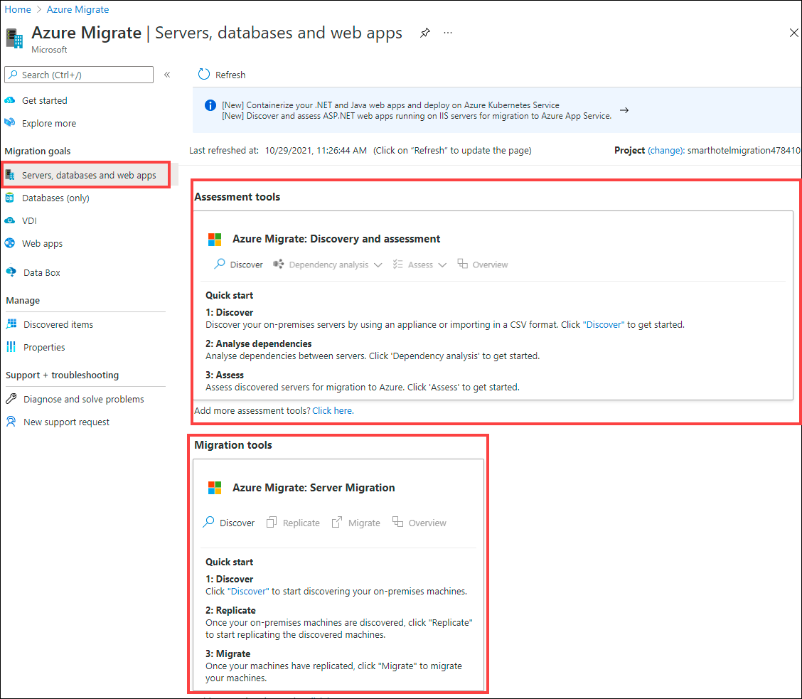
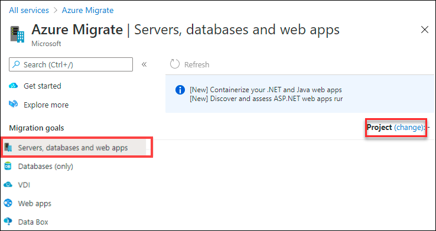
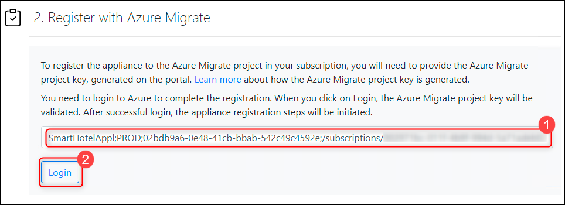
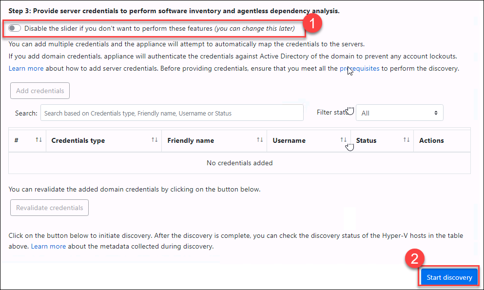
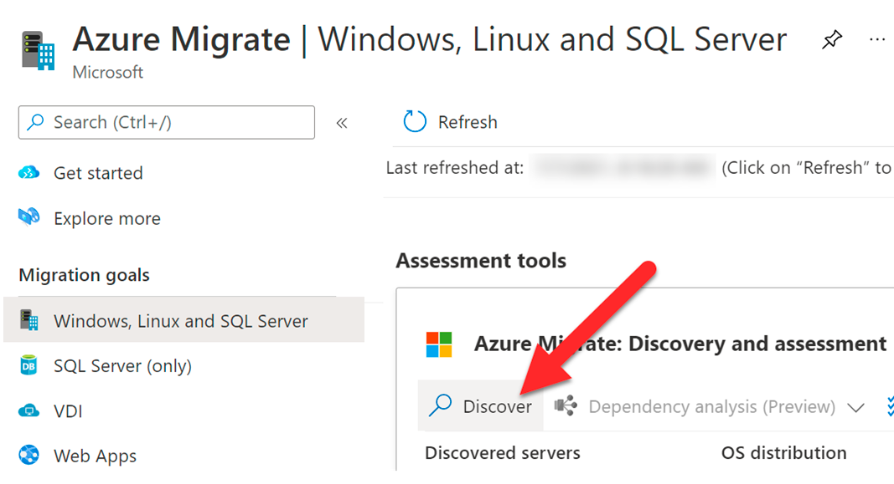
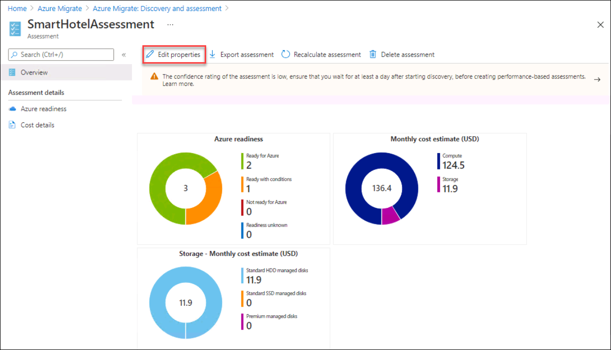
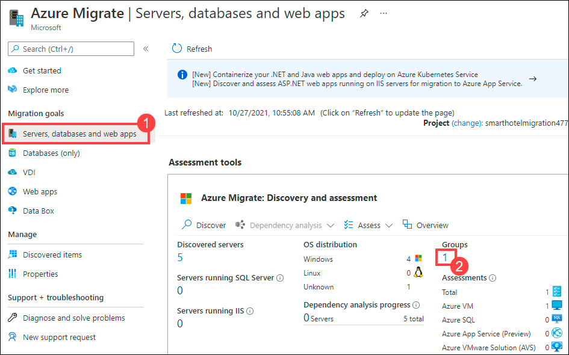

## Exercise 1: Discover and assess the on-premises environment

Duration: 60 minutes

In this exercise, you will use Azure Migrate: Server Assessment to assess the on-premises environment. This will include selecting Azure Migrate tools, deploying the Azure Migrate appliance into the on-premises environment, creating a migration assessment, and using the Azure Migrate dependency visualization.

### Task 1: Select the Azure Migrate project and add assessment and migration tools

In this task, you will and select the assessment and migration tools, the Azure Migrate project has been pre-created for you.

> **Note**: In this lab, you will use the Microsoft-provided assessment and migration tools within Azure Migrate. A number of third-party tools are also integrated with Azure Migrate for both assessment and migration. You may wish to spend some time exploring these third-party options outside of this lab.

1. If you are not logged in already, click on Azure portal shortcut that is available on the desktop and log in with below Azure credentials.
    * Azure Username/Email: <inject key="AzureAdUserEmail"></inject> 
    * Azure Password: <inject key="AzureAdUserPassword"></inject>

2. Click on **Show Portal Menu (1)** bar and select **All services (2)** in the portal's left navigation.
 
    

3. In the search bar, search for **Azure Migrate** and select it from the suggestions to open the Azure Migrate Overview blade, as shown below. 
 
    

4. Under Migration goals select **Servers, databases and web apps**.

    

5. Now, you should see the **Azure Migrate: Discovery and assessment** and **Azure Migrate: Server Migration** panels for the current migration project, as shown below.

    
    
    >**Note**: If you are not able to see the **Azure Migrate: Discovery and assessment** and **Azure Migrate: Server Migration** panels, please follow the below instructions to select the migration project.

     1. Select **Project(change)**. 

        
        
     2. Select your **subscription (1)** and select existing project named **SmartHotelMigration<inject key="DeploymentID" enableCopy="false" />** **(2)**. Then, select **Ok (3)**.

        


#### Task summary 

In this task you created an Azure Migrate project, using the default built-in tools for server assessment and server migration.

### Task 2: Deploy the Azure Migrate appliance

In this task, you will deploy the Azure Migrate appliance in the on-premises Hyper-V environment. This appliance communicates with the Hyper-V server to gather configuration and performance data about your on-premises VMs, and returns that data to your Azure Migrate project.

1. Under **Azure Migrate: Discovery and assessment**, select **Discover** to open the **Discover** blade.
 
    
 
2. Under **Are your machines virtualized?**, select **Yes, with Hyper-V** from the **drop-down** menu.

    

3.  In **1: Generate Azure Migrate project key**, provide below name for the **Azure Migrate appliance** that you will set up for discovery of Hyper-V VMs. Select **Generate key** to start the creation of the required Azure resources.

     ```
    SmartHotelAppl
    ```
 
    >**Note**: If the Azure Migrate project key generation failed with error **Vault name 'SmartHotekMigrxxxx' is already in use**. Please follow the below steps.
    
     - Go to the **Azure Migrate** and open the Azure Migrate **Overview** blade. 
    
     - Select **Discover, assess and migrate** and then select **Create project**. Select your subscription and resource group named **AzureMigrateRG**.
    
     - Create a **new project** with the name **SmartHotel<inject key="DeploymentID" enableCopy="false" />**, select that newly created project in Azure Migrate and generate the key again.   
    
    

    >**Note**: If you are running this lab in a shared Azure Migrate project, you will need to provide an appliance name that is unique in the project. Append characters to the end of appliance name to make your appliance name unique. For example: **SmartHotelAppl123**.

4.  **Wait** for the key to be generated, then copy the **Azure Migrate project key** to your clipboard.

    

5.  Read through the instructions on how to download, deploy and configure the Azure Migrate appliance then close the 'Discover machines' blade by clicking on cross button **X** (do **not** download the .VHD file or .ZIP file, the .VHD has already been downloaded for you). 
 
     

6. Go to **Start** button in the VM, search for **Hyper-V Manager** there and select it. 

   > You can also open the **Hyper-v manager** by clicking on the icon that is present in the taskbar. 

     

7. In Hyper-V Manager, select **SMARTHOST<inject key="DeploymentID" enableCopy="false" />**. You should now see the AzureMigrateAppliance VM and four VMs that comprise the on-premises SmartHotel application.

     

8. In Hyper-V Manager, select the **AzureMigrateAppliance** VM, then select **Start** on the right if not already running.

   
   
    >**Note**: If you receive an error while starting the **AzureMigrateAppliance** VM, then you can check if vm is in Saved state. If yes, please follow the below instructions to start the vm.

     1. Right click on the Azure Migrate appliance VM and select Upgrade Configuration version.
     2. On the pop-up, Select discard saved state and Upgrade
     3. Wait until all the updates are installed, then you can login to the vm using the password : <inject key="SmartHotelHost Admin Password" />

#### Task summary 

In this task you deployed the Azure Migrate appliance in the on-premises Hyper-V environment.

### Task 3: Configure the Azure Migrate appliance

In this task, you will configure the Azure Migrate appliance and use it to complete the discovery phase of the migration assessment.

1.  In Hyper-V Manager, select the **AzureMigrateAppliance** VM, then select **Connect** on the right.

    

2.  Log into the VM with the **Administrator password**: **<inject key="SmartHotelHost Admin Password" />** (the login screen may pick up your local keyboard mapping, use the 'eyeball' icon to check).

3.  Launch the **Azure Migrate appliance configuration Manager wizard** using the shortcut available on the desktop (wait for a minute or two, the browser will open showing the Azure Migrate appliance configuration wizard)

    
    
    >**Note**: If you receive a prompt asking for credentials after launching the **Azure Migrate appliance configuration wizard** using the shortcut available on the desktop, please follow the instructions from [here](https://github.com/CloudLabsAI-Azure/Know-Before-You-Go/blob/main/AIW-KBYG/AIW-Infrastructure-Migration.md#1-exercise1---task3---step3) to connect to Azure Migrate appliance configuration wizard.

4.  On opening of the appliance configuration wizard, if a pop-up with the license terms appears, accept the terms by selecting **I agree**.

    
    
    >**Note** : If at all **Azure Migrate appliance configuration wizard** opens in **Internet Explorer** and received any compatabilty issue please close the browser and open it again using the desktop shortcut.

5. Under **Set up prerequisites**, the following two steps to verify Internet connectivity and time synchronization should pass automatically.

   

6. **Wait** while the wizard installs the latest Azure Migrate updates. If prompted for credentials, enter user name **Administrator** and password **<inject key="SmartHotelHost Admin Password" />**. Once the Azure Migrate updates are completed, you may see a pop-up if the management app restart is required, and if so, select **Refresh** to restart the app.  

   

    > Once restarted, the 'Set up prerequisites' steps of the Azure Migrate wizard will re-run automatically. Once the prerequisites are completed, you can proceed to the next panel, **Register with Azure Migrate**.

7.  At the next phase of the wizard, **Register with Azure Migrate**, paste the **Azure Migrate project key (1)** copied from the Azure portal earlier and select **Login (2)**. 
   
    > If you do not have the key, go to **Server Assessment > Discover > Manage existing appliances**, select the appliance name you provided at the time of key generation and copy the corresponding key.)

    


8. After you select **Login**, you will be presented with a **Continue with Azure login** pop-up . On the **Continue with Azure login** pop-up dialog, click on **Copy code & Login**.

   

    > This will open an Azure login prompt in a new browser tab (if it doesn't appear, make sure the pop-up blocker in the browser is disabled) paste the **code (1)** and click on **Next (2)**. You will then be asked for your Azure portal credentials to complete the login process.

   

9. Log in using the below Azure credentials and select **Continue** on the **Are you trying to sign in to Microsoft Azure PowerShell?** window to complete the login process. Once you have logged in, return to the Azure Migrate Appliance tab and the appliance registration will start automatically and displays below message once the registration is successful.
    
    * Azure Username/Email: <inject key="AzureAdUserEmail"></inject> 
    * Azure Password: <inject key="AzureAdUserPassword"></inject> 

   

   Once the registration has completed, you can proceed to the next panel, **Manage credentials and discovery sources**.

10. In **Step 1: Provide Hyper-V host credentials**, select **Add credentials**.

    


11. Specify the following details on the **Add credentails** blade for the Hyper-V host/cluster that the appliance will use to discover VMs and select **Save**.
 
      1. Friendly name : Enter **hostlogin** 
      2. Username: <inject key="SmartHotelHost Admin Username" />
      3. Password: <inject key="SmartHotelHost Admin Password" />

    

     > **Note**: The Azure Migrate appliance may not have picked up your local keyboard mapping. Select the 'eyeball' in the password box to check the password was entered correctly.

     > **Note:** Multiple credentials are supported for Hyper-V VMs discovery, via the 'Add more' button.

12. In **Step 2: Provide Hyper-V host/cluster details**, select **Add discovery source** to specify the Hyper-V host/cluster IP address/FQDN and the friendly name for credentials to connect to the host/cluster.

    

13. On the **Add discovery source** blade, provide the following details:
     
      1. Select **Add single item**
      1. IP Address / FQDN:  Enter **SmartHost<inject key="DeploymentID" enableCopy="false" />** .
      1. Friendly name: Select **hostlogin** from the dropdwon and 
      1. select **Save**.

    

    > **Note:** You can either **Add single item** at a time or **Add multiple items** in one go. There is also an option to provide Hyper-V host/cluster details through **Import CSV**.

14. The appliance will validate the connection to the Hyper-V hosts/clusters added and show the **Validation status** in the table against each host/cluster

    

    > **Note:** When adding discovery sources:
    > -  For successfully validated hosts/clusters, you can view more details by selecting their IP address/FQDN.
    > -  If validation fails for a host, review the error by selecting the Validation failed in the Status column of the table. Fix the issue and validate again.
    > -  To remove hosts or clusters, select **Delete**.
    > -  You can't remove a specific host from a cluster. You can only remove the entire cluster.
    > -  You can add a cluster, even if there are issues with specific hosts in the cluster.

15. In **Step 3: provide server credentials to perform software inventory and agentless dependency analysis**, **Disable the slider (1)** and select **Start discovery (2)** to kick off VM discovery from the successfully validated hosts/clusters.

     > **Note:** The discovery process can take upto 10 minutes. 
   
    

16. Wait for the Azure Migrate status to show **Discovery has been successfully initiated**. This will take several minutes. After the discovery has been successfully initiated, you can check the discovery status against each host/cluster in the table..

17. Return to the **Azure Migrate** blade in the Azure portal.  Select **Servers, databases and web apps (1)**, then select **Refresh (2)**.  Under **Azure Migrate: Servers, databases and web apps** you should see a **count (3)** of the number of servers discovered so far. If discovery is still in progress, select **Refresh** periodically until 5 discovered servers are shown. This may take several minutes.

     

    **Wait for the discovery process to complete before proceeding to the next Task**.
    
>**Note**: If you see that the discovery process is stuck at **Discovery is in progress** state for more than 5 mintues, then please follow the steps from [here](https://github.com/CloudLabsAI-Azure/Know-Before-You-Go/blob/main/AIW-KBYG/AIW-Infrastructure-Migration.md#2-exercise1---task3---step17) to see **count** of the number of servers discovered so far.
    
>**Note**: If the discovery process takes an inordinate amount of time or the source resources are not allowing the appliance to discover the resources in an appropriate time to complete this exercise, you can manually import the systems via CSV:
> 
>_Discover Import_
>
>If the system is not able to assess the environment or identify details, you can import an inventory of the environment, their configuration, and utilization with a CSV file.  You can download an example [CSV file here](https://go.microsoft.com/fwlink/?linkid=2109031). The properties in the CSV are:
> 
> -	Server Name – name of the computer
> 
> -	IP Addresses – semi-colon separated list of IPv4 and IPv6 addresses used by the machine
> 
> -	Cores – number of vCPU used 
> 
> -	Memory – amount of memory in MB
> 
> -	OS Details
> 
>   - Name – type of operating system
>   - Version – version of the OS in use
>   -	Architecture – architecture (like x64/x86)
> 
> -	CPU Utilization – percentage of the CPU in use
> 
> -	Memory Utilization – percentage spike of the CPU usage
> 
> -	Network
>   -	Adapter count – number of NIC’s attached to the machine
>   -	Input Throughput – amount of throughput in Mbps into system
>   -	Output Throughput – amount of throughput in Mbps out of the system
> 
> -	Boot Type – type of boot used by systems (UEFI/BIOS)
> 
> -	Disks
>   -	Number of disks – number of disks attached to disk
>   -	Per disk size – size of disk in GB
>   -	Per disk reads (Bytes) – amount of MB per second read from each disk
>   -	Per disk writes (Bytes) – amount of MB per second written to each disk
>   -	Per disk reads (IOPS) – count of output operations from disk per second
>   -	Per disk writes (IOPS) – count of input operations from disk per second
> 
> Once the CSV is populated, you can then import the systems into the Migrate assessment phase by doing the following:
>
>1.	Go to the Azure Migrate, under Migration goals, select the appropriate resource type (ie: Servers, databases and web apps).
>
>2.	Select the **Discover** link.
>
>   
>
>3. Choose **Import using CSV** at the top.
>
>
>
>4. Upload the CSV file of your resources using the on-screen instructions by selecting **Import** to read the file.

     

#### Task summary 

In this task you configured the Azure Migrate appliance in the on-premises Hyper-V environment and started the migration assessment discovery process.

### Task 4: Create a migration assessment

In this task, you will use Azure Migrate to create a migration assessment for the SmartHotel application, using the data gathered during the discovery phase.

1. Select **Assess** under **Azure Migrate: Discovery and assessment** and click on **Azure VM** to start a new migration assessment.

   

2. On the Assess servers blade, ensure the Assessment type to be **Azure VM** and Discovery Source to be **Servers discovered from Migrate Appliance**. Under **Assessment settings**, select **Edit**.

   

3. The **Assessment settings** blade allows you to tailor many of the settings used when making a migration assessment report. Take a few moments to explore the wide range of assessment properties. Hover over the information icons to see more details on each setting. Choose any settings you like, then select **Save**. (You have to make a change for the Save button to be enabled; if you don't want to make any changes, just close the blade.)

   

4. Select **Next** to move to the **Select servers to assess** tab and enter the following information:
     
     1. Assessment name: Enter **SmartHotelAssessment** 
     1. Select or create a group: Choose **Create New** and enter the 
     1. Group name: Enter **SmartHotel VMs**.
     1. Add machines to the Group:  Select **SmarthotelAppl** from dropdown.
     1. Select the **smarthotelweb1**, **smarthotelweb2** and **UbuntuWAF** VMs and
     1.  Click on **Next**.

   

    **Note:** There is no need to include the **smarthotelSQL1** or **AzureMigrateAppliance** VMs in the assessment, since they will not be migrated to Azure. (The SQL Server will be migrated to the SQL Database service and the Azure Migrate Appliance is only used for migration assessment.)

5. Click on **Create assessment** to create the assessment. 

   

6. On the **Servers, databases and web apps** blade, select **Refresh** periodically until the number of assessments shown is **1** (This may take few minutes). Once the assessments count is updated, click on **1** that is next to **Total** under **Assessments**.  

    ")
    
7. Select **Assessments** under **Azure Migrate: Discovery and assessment** to see a list of assessments. Then select the actual assessment.

   ")

8. Take a moment to study the assessment overview and select **Edit properties**..

   

9. Note how you can now modify the assessment properties you choose earlier. Change a selection of settings, and **Save** your changes. After a few moments, the assessment report will update to reflect your changes.

10. Select **Azure readiness** (either the chart or on the left navigation). Note that for the **UbuntuWAF** VM, a specific concern is listed regarding the readiness of the VM for migration.

    

11. Select **Unknown OS** for **UbuntuWAF**. A new browser tab opens showing Azure Migrate documentation. Note on the page that the issue relates the OS not being specified in the host hypervisor, so you must confirm the OS type and version is supported.

    

12. Return to the portal browser tab and select **UbuntuWAF** VM to view details of the issue. Note the recommendation to migrate the VM using **Azure Migrate: Server Migration**.

    

13. Take a few minutes to explore other aspects of the migration assessment.

>**Note**: The process of gathering information of operating system environments (OSE) and migrating data of VMs between environments takes some time due to the nature of transferring data.  However, there are a few steps that can be done to speed up and view how the system works.  These are a few options:
>
> Common steps to refresh data: (also see [Troubleshoot Discovery](https://docs.microsoft.com/en-us/azure/migrate/troubleshoot-discovery#common-software-inventory-errors))
> 
> -	[Server data not updating in portal](https://docs.microsoft.com/en-us/azure/migrate/troubleshoot-discovery#server-data-not-updating-in-portal) – if the servers’ data is not refreshing, this is a method to accelerate it.
> 
> -	[Do not see software inventory details](https://docs.microsoft.com/en-us/azure/migrate/troubleshoot-discovery#do-not-see-software-inventory-details-even-after-updating-guest-credentials) – by default the software inventory is only refreshed once every 24 hours. This forces a refresh.
> 
> -	[Software inventory errors](https://docs.microsoft.com/en-us/azure/migrate/troubleshoot-discovery#common-software-inventory-errors) – during inventory there are sometimes error codes returned. This lists all the error codes and meanings.
>
>_Refresh Data_
> 
> Many issues in the Migrate can be related to the appliance not refreshing the data due to regular schedules or data not being transferred.  Forcing the data and information to be updated can be achieved with the following steps:
> 1.	In Servers, databases and web apps > Azure Migrate: Discovery and assessment, select Overview.
> 2.	Under Manage, select Appliances.
> 3.	Select Refresh services.
> 4.	Wait for the refresh operation to complete. You should now see up-to-date information.
>


#### Task summary 

In this task you created and configured an Azure Migrate migration assessment.

### Task 5: Configure dependency visualization

When migrating a workload to Azure, it is important to understand all workload dependencies. A broken dependency could mean that the application doesn't run properly in Azure, perhaps in hard-to-detect ways. Some dependencies, such as those between application tiers, are obvious. Other dependencies, such as DNS lookups, Kerberos ticket validation or certificate revocation checks, are not.

In this task, you will configure the Azure Migrate dependency visualization feature. This requires you to first create a Log Analytics workspace, and then to deploy agents on the to-be-migrated VMs.

1. Return to the **Azure Migrate** blade in the Azure Portal, select **Servers, databases and web apps (1)**. Under **Discovery and assessment** select **Groups (2)**,

       

2. Select the **SmartHotel VMs** group to see the group details. 

      

3. Note that each VM has their **Dependencies** status as **Requires agent installation**. Select **Requires agent installation** for the **smarthotelweb1** VM.

   

4. On the **Dependencies** blade, select **Configure OMS workspace**.

   

5. On the **Configure OMS workspace** blade, provide the below information and select **Configure**.

   - OMS workspace: Enter **AzureMigrateWS<inject key="DeploymentID" enableCopy="false" />**
   - OMS workspace location: Select **East US** from the dropdown.

  

6. Wait for the workspace to be deployed. Once it is deployed, navigate to **AzureMigrateWS<inject key="DeploymentID" enableCopy="false" />** by clicking on it.

   

7. Select **Agents management** under **Settings** from the left hand side menu. Make a note of the **Workspace ID** and **Primary Key** (for example by using Notepad).

   

8. Return to the Azure Migrate **Dependencies** blade. Copy each of the 4 agent download URLs and paste them alongside the Workspace ID and key you noted in the previous step. 
   
   

9. From **Hyper-V Manager** console, select **smarthotelweb1** and select **Connect**.

   

10. Select **Connect** again when prompted and log in to the **Administrator** account using the password **<inject key="SmartHotelHost Admin Password" />**.

11. Go to **Start** button in the **smarthotelweb1** VM and select **Internet Explorer** to open it. Paste the link to the 64-bit Microsoft Monitoring Agent for Windows, which you noted earlier. When prompted, **Run** the installer.

    > **Note:** You may need to disable **Internet Explorer Enhanced Security Configuration** on **Server Manager** under **Local Server** to complete the download. 

    

12. On the **Welcome to the Microsoft Monitoring Agent Setup Wizard** blade, select **Next**. 

    

13. On the **Microsoft Software License Terms** blade, select **I Agree** 

    

14. On the **Destination Folder** blade, leave everything as default and select **Next**. 

     

15. On the **Agent Setup Options** blade, select **Connect the agent to Azure Log Analytics (OMS)** and select **Next**.

     

16. On the **Azure Log Analytics** blade, enter the Workspace ID and Workspace Key that you copied earlier, and select **Azure Commercial** from the Azure Cloud drop-down then select **Next**.

    

17. On the **Microsoft Update** blade, leave everything as default and select **Next**. 

    

18. On the **Ready to Install** blade, click on **Install**. 

    

19. Select **Finish** to finish the installation process of **Microsoft Monitoring Agent for Windows**.

    

20. Paste the link to the Dependency Agent Windows installer into the browser address bar. **Run** the installer.

    

21. On the **License Agreement** blade, select **I Agree** to accept the agreement and continue. 

     

22. On the **Completing Dependency Agent Setup** blade, select **Finish** to finish the installation process.

     
 

   > **Note:** You do not need to configure the workspace ID and key when installing the Dependency Agent, since it uses the same settings as the Microsoft Monitoring Agent, which must be installed beforehand.

23. Close the virtual machine connection window for the **smarthotelweb1** VM.  Connect to the **smarthotelweb2** VM and repeat the installation process (steps 10-22) for both agents (the administrator password is the same as for smarthotelweb1). Close the virtual machine connection window for the **smarthotelweb2** VM, once the installation of agents is done.

You will now deploy the Linux versions of the Microsoft Monitoring Agent and Dependency Agent on the **UbuntuWAF** VM. To do so, you will first connect to the UbuntuWAF remotely using an SSH session.

24. Open a command prompt using the desktop shortcut.  

    > **Note**: The SmartHotelHost runs Windows Server 2019 with the Windows Subsystem for Linux enabled. This allows the command prompt to be used as an SSH client. More info of supported Linux on Azure can be found here: https://Azure.com/Linux. 

25. Enter the following command to connect to the **UbuntuWAF** VM running in Hyper-V on the SmartHotelHost:

    ```bash
    ssh demouser@192.168.0.8
    ```

26. Enter 'yes' when prompted whether to connect. Use the password **<inject key="SmartHotelHost Admin Password" />**.

    

27. Enter the following command, followed by the password **<inject key="SmartHotelHost Admin Password" />** when prompted:
  
    ```
    sudo -s
    ```

    > This gives the terminal session elevated privileges.

28. Enter the following command, substituting \<Workspace ID\> and \<Workspace Key\> with the values copied previously. Answer **Yes** when prompted to restart services during package upgrades without asking.  

    ```
    wget https://raw.githubusercontent.com/Microsoft/OMS-Agent-for-Linux/master/installer/scripts/onboard_agent.sh && sh onboard_agent.sh -w <Workspace ID> -s <Workspace Key>
    ```

    > **Note**: If you receive any error while running the above command, run the below command to update the packages and perform **Step 28** again.
     
     ```
     apt-get update
     ```

29. Enter the following command, substituting \<Workspace ID\> with the value copied earlier:

    ```s
    /opt/microsoft/omsagent/bin/service_control restart <Workspace ID>
    ```

30. Enter the following command. This downloads a script that will install the Dependency Agent.

    ```s
    wget --content-disposition https://aka.ms/dependencyagentlinux -O InstallDependencyAgent-Linux64.bin
    ```

31. Install the dependency agent by running the script download in the previous step.

    ```s
    sh InstallDependencyAgent-Linux64.bin -s
    ```

    
    
#### Task summary 

In this task you configured the Azure Migrate dependency visualization feature, by creating a Log Analytics workspace and deploying the Azure Monitoring Agent and Dependency Agent on both Windows and Linux on-premises machines.

### Task 6: Explore dependency visualization

In this task, you will explore the dependency visualization feature of Azure Migrate. This feature uses data gathered by the dependency agent you installed in Task 5.

1. Return to the Azure Portal and refresh the Azure Migrate **SmartHotel VMs** VM group blade. The 3 VMs on which the dependency agent was installed should now show their status as **Installed**. (If not, refresh the page **using the browser refresh button**, not the refresh button in the blade.  It may take up to **5 minutes** after installation for the status to be updated.)

   
   
   >**Note**: If you notice that the dependency agent status is showing as **Requires Agent Installation** instead of Installed even after installing dependency agents in all the three VMs, please follow the steps from [here](https://github.com/CloudLabsAI-Azure/Know-Before-You-Go/blob/main/AIW-KBYG/AIW-Infrastructure-Migration.md#4-exercise1---task6---step1) to confirm dependency agent installation in VMs using Log Analytics workspace.
 
1. Select **View dependencies**.

   
   
1. Take a few minutes to explore the dependencies view. Expand each server to show the processes running on that server. Select a process to see process information. See which connections each server makes.

    

#### Task summary 

In this task you explored the Azure Migrate dependency visualization feature.

#### Exercise summary 

In this exercise, you used Azure Migrate to assess the on-premises environment. This included selecting Azure Migrate tools, deploying the Azure Migrate appliance into the on-premises environment, creating a migration assessment, and using the Azure Migrate dependency visualization.
