## Exercise 2: Migrate the Application Database

Duration: 60 minutes

In this exercise you will migrate the application database from the on-premises Hyper-V virtual machine to a new database hosted in the Azure SQL Database service. You will use the Azure Database Migration Service to complete the migration, which uses the Microsoft Data Migration Assistant for the database assessment and schema migration phases.

### Task 1: Assess the on-premises database using Data Migration Assistant

In this task you will use Microsoft Data Migration Assistant (DMA) to assess the on-premises database. DMA is integrated with Azure Migrate providing a single hub for assessment and migration tools.

1. Go to the **Azure Migrate** blade in the Azure portal. Select the **Get Started** panel, then select **Assess and migrate databases**.

   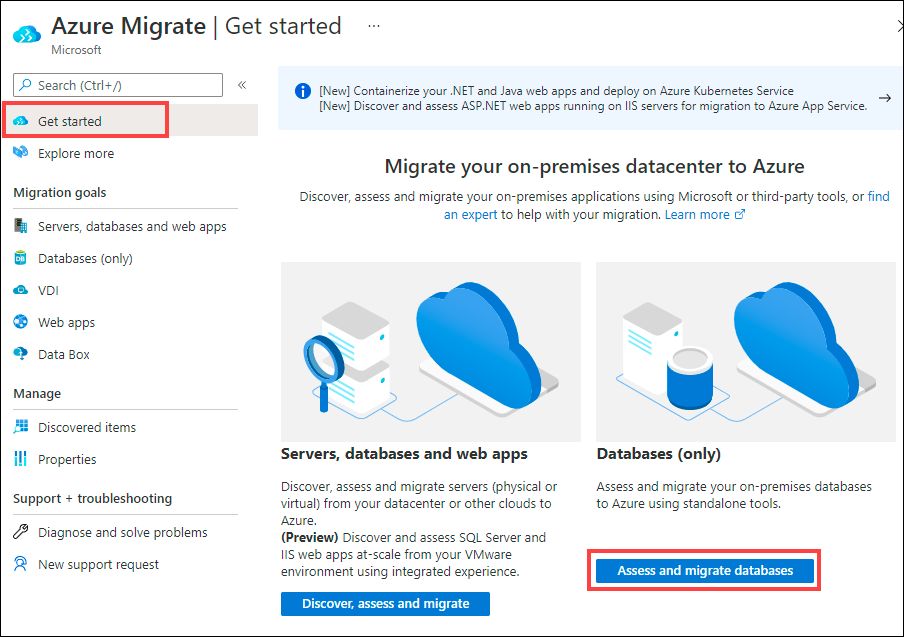  

2. Under **Assessment tools**, click on **Click here** link to add a tool.

   
   
 > **Note**: Change the Project in the right hand top corner if you don't see the **Azure Migrate: Database Assessment** panel.

3. Select **Azure Migrate: Database Assessment**, then select **Add tool**
    
   
   
4. Under **Migration tool**, click on **Click here** link to add a tool.

   
    
5. Select **Azure Migrate: Database Migration**, then select **Add tool**.
    
   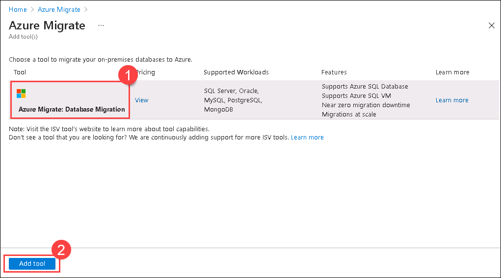

6. Once the tools are installed in Azure Migrate, the portal should show the **Azure Migrate - Databases (only)** blade. 

7. From within **JumpVM**, open **Windows Explorer** and navigate to the **C:\\Program Files\\Microsoft Data Migration Assistant** folder. Right click on the **Dma.exe.config** file and select **Edit with Notepad++**. Search for **AzureMigrate** and remove the **\<\!-- and --\>** around the line setting the **EnableAssessmentUploadToAzureMigrate** key in line **137**. **Save** the file and close Notepad when done.

   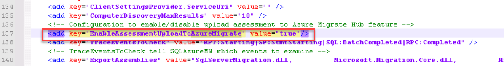

8. Launch **Microsoft Data Migration Assistant** using the desktop icon .

   
   
   > **Note**: If you get a pop-up for updating the Data Migration Assistant, click on **Cancel**.
   
     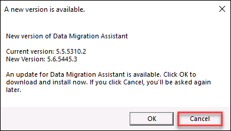

9. In the Data Migration Assistant, select the **+ New** icon.  Fill in the project details as follows:

   - Project type: **Assessment**
  
   - Project name: **SmartHotelAssessment**
  
   - Assessment type: **Database Engine**
  
   - Source server type: **SQL Server**
  
   - Target server type: **Azure SQL Database**
     
10. Select **Create** to create the project.

    

11. On the **Options** tab **select Next**.

12. On the **Select sources** page, in the **Connect to a server** dialog box, provide the connection details to the SQL Server, and then select **Connect**.

    - Server name: **192.168.0.6**
  
    - Authentication type: **SQL Server Authentication**
  
    - Username: **sa**
  
    - Password: **<inject key="SmartHotelHost Admin Password" />**
  
    - Encrypt connection: **Checked**
  
    - Trust server certificate: **Checked**

    

13. In the **Add sources** dialog box, select **SmartHotel.Registration**, then select **Add**.

    

14. Select **Start Assessment** to start the assessment. 

    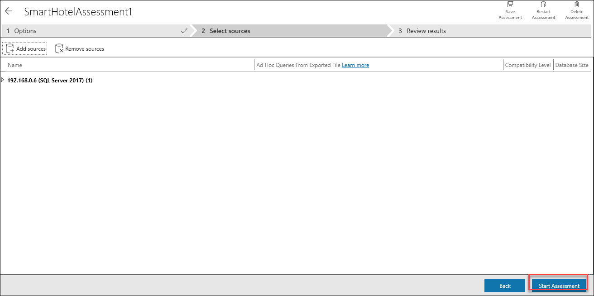

15. **Wait** for the assessment to complete, and review the results. The results should show the unsupported feature, **Service Broker feature is not supported in Azure SQL Database**. For this migration, you can ignore these issues.

    > **Note**: For Azure SQL Database, the assessments identify feature parity issues and migration blocking issues.

    >- The SQL Server feature parity category provides a comprehensive set of recommendations, alternative approaches available in Azure, and mitigating steps to help you plan the effort into your migration projects.

    >- The Compatibility issues category identifies partially supported or unsupported features that reflect compatibility issues that might block migrating on-premises SQL Server database(s) to Azure SQL Database. Recommendations are also provided to help you address those issues.

16. Select **Upload to Azure Migrate** to upload the database assessment to your Azure Migrate project (this button may take a few seconds to become enabled).

    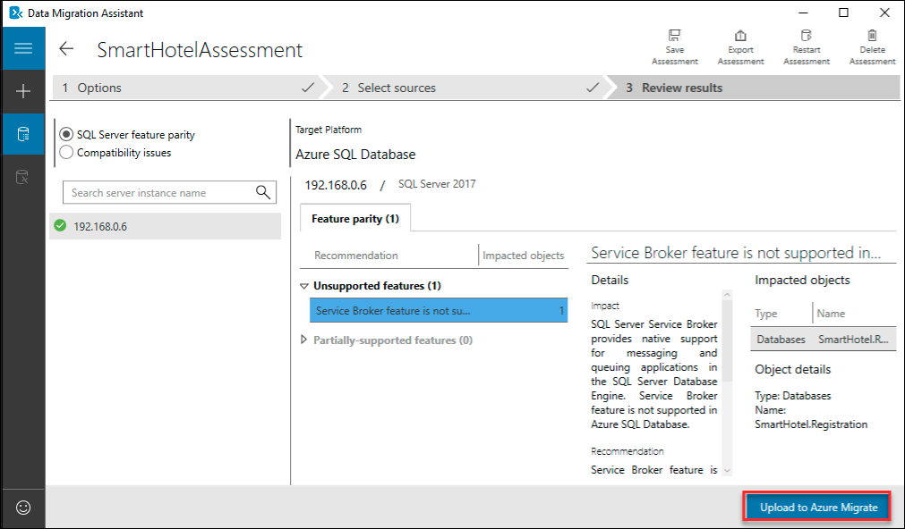

17. On the **Connect to Azure** blade, select **Azure** from the dropdown on the right then select **Connect**. Enter the below Azure credentials when prompted. Select your **Subscription** and **Azure Migrate Project** using the dropdowns, then select **Upload**. Once the upload is complete, select **OK** to dismiss the notification.

    * Azure Username/Email: <inject key="AzureAdUserEmail"></inject> 
    * Azure Password: <inject key="AzureAdUserPassword"></inject> 
    
    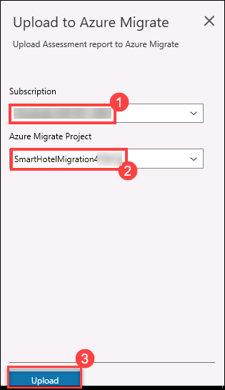

18. Return to the **Azure Migrate - Databases (only)** blade in the Azure portal. Refreshing the page should now show the assessed database.

    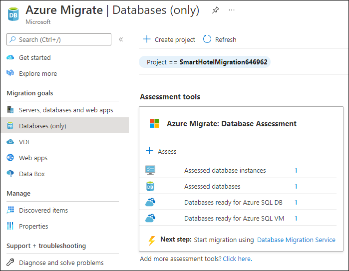

#### Task summary 

In this task you used Data Migration Assistant to assess an on-premises database for readiness to migrate to Azure SQL, and uploaded the assessment results to your Azure Migrate project. The DMA is integrated with Azure Migrate providing a single hub for assessment and migration tools.

### Task 2: Create a DMS migration project

In this task you will create a Migration Project within the Azure Database Migration Service (DMS). This project contains the connection details for both the source and target databases. In order to connect to the target database, you will also create a private endpoint allowing connectivity from the subnet used by the DMS.

In subsequent tasks, you will use this project to migrate both the database schema and the data itself from the on-premises SQL Server database to the Azure SQL Database.

We'll start by creating the private endpoint that allows the DMS to access the database server.

1. In the Azure portal, expand the portal's left navigation by selecting **Show portal menu** in the top left, then click on **Resource groups** and select the **SmartHotelRG** resource group, select the database server **smarthoteldb<inject key="DeploymentID" enableCopy="false" />**.
 
   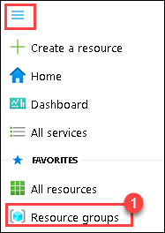
   
   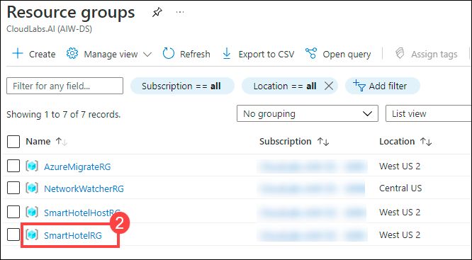

   

2. From the left hand side menu, under **Security** select **Networking** then **Private access** tab. Now, under **Private endpoint connections** click on **+ Private endpoint**.

    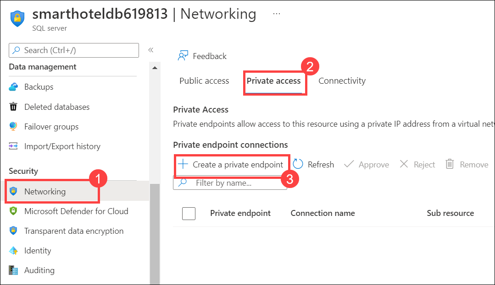

3. On the **Basics** tab that appears, enter the following configuration then select **Next: Resource**. 

   - Resource group: **SmartHotelRG**
  
   - Observe **Network Interface name**
  
   - Name: **SmartHotel-DB-for-DMS**
  
   - Region: Select **<inject key="Region" enableCopy="false" />** from the dropdown.
  
   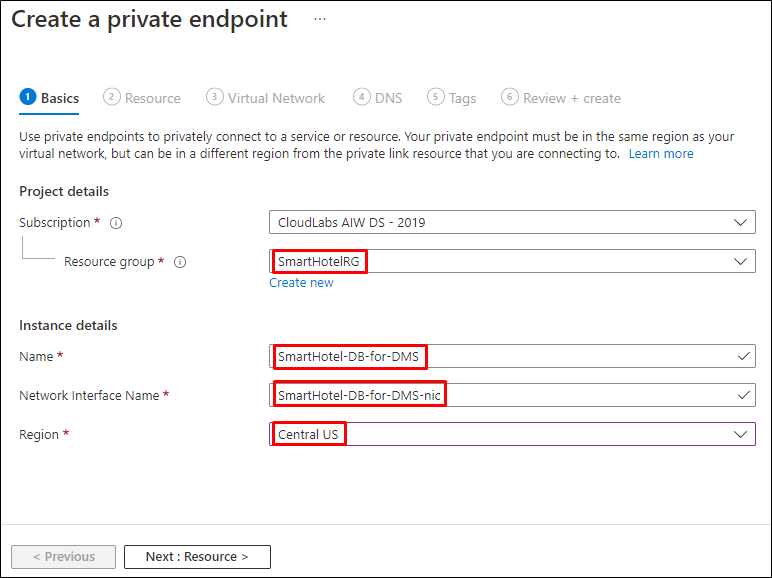

4. On the **Resource** tab, make sure the following configurations are selected and click on **Next: Virtual Network**. 
  
   - Subscription: **your subscription**.
  
   - Resource type: **Microsoft.Sql/servers**
  
   - Resource: SQL database server **smarthoteldb<inject key="DeploymentID" enableCopy="false" />** which you created previously.
   
   - Target sub-resource: **sqlServer**

   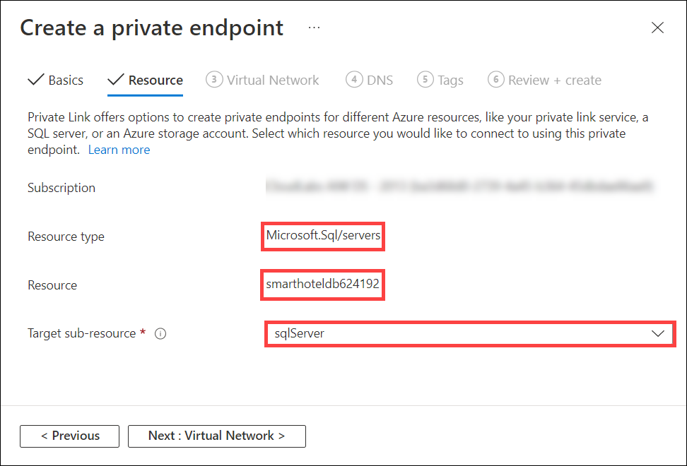
   
5. On the **Virtual Network** tab enter the following configuration, click on **Next: DNS**..

   - Virtual network: **DMSvnet**
  
   - Subnet: **DMS (10.1.0.0/24)**

   - Private IP configuration: **Dynamically allocate IP address**

   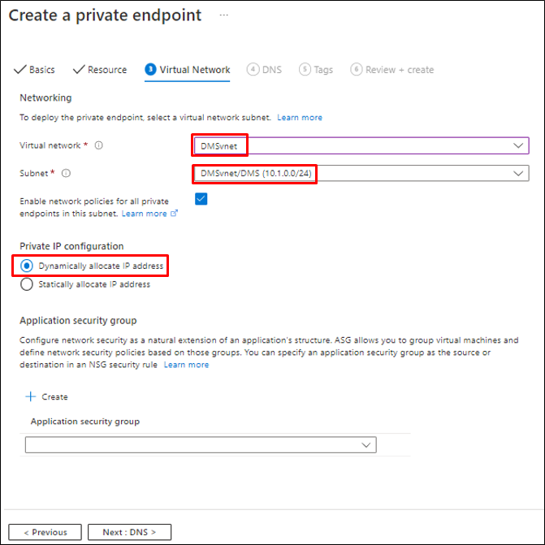

6.  On the **DNS** tab, enter the following configuration select **Tags** and click on **Review + Create** then **Create**:

     - Integrate with private DNS zone: **Yes**
  
     - Resource Group: Select **SmartHotelRG** from drop down.

     - Private DNS zones: (default) **privatelink.database.windows.net**

    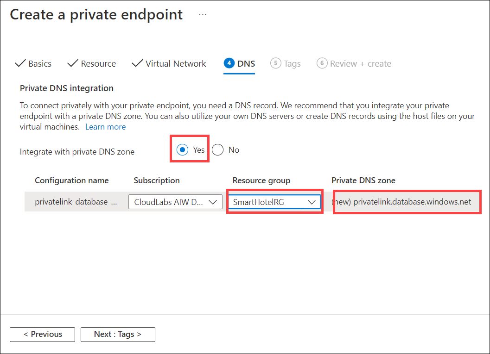

7. Select **Create** and **Wait** for the deployment to complete. Once the deployment is done, click on  **Go to resource**.

   

8. On the **SmartHotel-DB-for-DMS** private endpoint blade, from the left hand side menu select **DNS configuration** which is under **Settings**.

   

9. On the **SmartHotel-DB-for-DMS | DNS configuration**, select the **Private DNS Zone** **privatelink.database.windows.net**.

   

10. On the **privatelink.database.windows.net** overview blade, note that the **Record set** with name **smarthoteldb<inject key="DeploymentID" enableCopy="false" />** and an internal IP address **10.1.0.X** is listed.

   

   >**Note**: Private DNS is used so that the database domain name, **\<your server\>.database.windows.net** resolves to the internal private endpoint IP address **10.1.0.X** when resolved from the DMSvnet, but resolves to the Internet-facing IP address of the database server when resolved from outside the DMSvnet. This means the same connection string (which contains the domain name) can be used in both cases.

11. Return to the Database server blade. Under **Security**, select **Networking** then **Public access** tab. Now, set `Public network access` to **Disabled**, then **Save** your changes.

    
  
    In the Azure portal, navigate to the **SmartHotelRG** resource group, and then to the database server **smarthoteldb<inject key="DeploymentID" enableCopy="false" />**.   From the Oveview page, copy the server name of the database and keep this in a text editor as we will be using this further.

12. Navigate to the Database Migration Service **SmartHotelDBMigration** resource blade in the **AzureMigrateRG** resource group and select **+ New Migration Project**.

    
 
13. In the **New migration project** blade, enter the below information,

    - Project name : Enter **DBMigrate** 
    - Leave the source server type as **SQL Server** and target server type as **Azure SQL Database**.
    - Choose type of activity : Select **Create project only** from the dropdown
    - Select **Create**.
 
    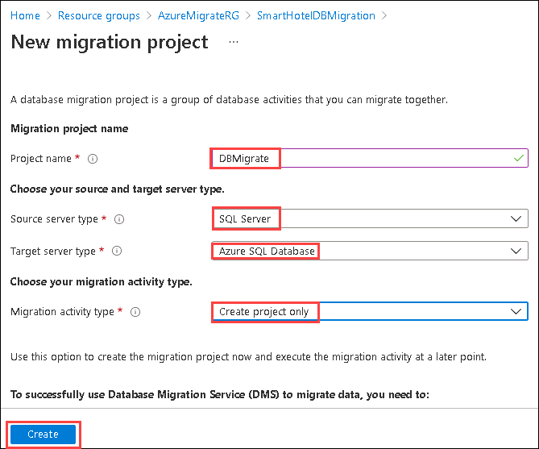

14. The Migration Wizard opens, showing the **Select source** step. Complete the settings as follows, then select **Next: Select databases**.

    - Source SQL Server instance name: **10.0.0.4**
  
    - Authentication type: **SQL Authentication**
  
    - User Name: **sa**
  
    - Password: **<inject key="SmartHotelHost Admin Password" />**

    - Encryption connection: **Checked**
  
    - Trust server certificate: **Checked**

    

    > **Note**: The DMS service connects to the Hyper-V host, which has been pre-configured with a NAT rule to forward incoming SQL requests (TCP port 1433) to the SQL Server VM. In a real-world migration, the SQL Server VM would most likely have its own IP address on the internal network, via an external Hyper-V switch.
    > The Hyper-V host is accessed via its private IP address (10.0.0.4). The DMS service accesses this IP address over the peering connection between the DMS VNet and the SmartHotelHost VNet. This simulates a VPN or ExpressRoute connection between a DMS VNet and an on-premises network.

15. In the **Select databases** step, the **Smarthotel.Registration** database should already be selected. Select **Next: Select target**.

    

15. Complete the **Select target** step as follows, then select **Next: Summary**:

    - Target server name: **You can either paste the server name value you copied earlier or enter this value smarthoteldb<inject key="DeploymentID" enableCopy="false"/>.database.windows.net**

    - Authentication type: **SQL Authentication**
  
    - User Name: <inject key="SmartHotelHost Admin Username"></inject>
  
    - Password: **<inject key="SmartHotelHost Admin Password" />**

    - Encrypt connection: **Checked**

    

    > **Note**: You can find the target server name in the Azure portal by browsing to your database.

    

17. At the **Project summary** step, review the settings and select **Save project** to create the migration project.

    

#### Task summary 

In this task you created a Migration Project within the Azure Database Migration Service. This project contains the connection details for both the source and target databases. A private endpoint was used to avoid exposing the database on a public IP address.

### Task 3: Migrate the database schema

In this task you will use the Azure Database Migration Service to migrate the database schema to Azure SQL Database. This step is a prerequisite to migrating the data itself.

The schema migration will be carried out using a schema migration activity within the migration project created in task 5.

1. The Azure portal should show a blade for the DBMigrate DMS project. Select **+ New Activity** and select **Schema only migration** from the drop-down.

   

2. The Migration Wizard is shown. Most settings are already populated from the existing migration project. At the **Select source** step, re-enter the source database password **<inject key="SmartHotelHost Admin Password" />**, then select **Next: Select target**.

   

3. At the **Select target** step, enter the password **<inject key="SmartHotelHost Admin Password" />** and select **Next: Select database and schema**.

   

4. At the **Select database and schema** step, select the below information,
   - Check that the **SmartHotel.Registration** database is selected.
   - **Target Database**: Select **smarthoteldb**.
   - **Schema Source**: Select **Generate from source**. 
   - Select **Next: Summary**.
 
   

5. At the **Summary** step, enter the below value as the **Activity name**. Select **Start migration** to start the schema migration process.

   ```
   SchemaMigration
   ```

   

6. The schema migration will begin. Select the **Refresh** button and watch the migration progress, until it shows as **Completed**.

   

#### Task summary 

In this task you used a schema migration activity in the Azure Database Migration Service to migrate the database schema from the on-premises SQL Server database to the Azure SQL database.

### Task 4: Migrate the on-premises data

In this task you will use the Azure Database Migration Service to migrate the database data to Azure SQL Database.

The schema migration will be carried out using an offline data migration activity within the migration project created in task 5.

1. Return to the Azure portal blade for your **DBMigrate** migration project in DMS. Select **+ New Activity** and select **Data migration** from the drop-down.

   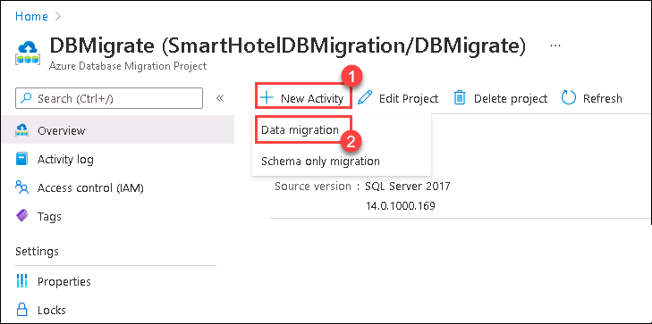

2. The Migration Wizard is shown. Most settings are already populated from the existing migration project. At the **Select source** step, re-enter the source database password **<inject key="SmartHotelHost Admin Password" />**, then select **Next: Select databases**.

   

3. At the **Select databases** blade, select **SmartHotel.Registration** database then select **Next: Select target**.

   
    
4. At the **Select target** step, enter the password **<inject key="SmartHotelHost Admin Password" />** and select **Next: Map to target databases**.

   

5. At the **Map to target databases** step, check the **SmartHotel.Registration** database. Under **Target Database** select **smarthoteldb** from the dropdown and click on **Next: Configure migration settings**.

   

6. On the **Configure migration settings** blade, **expand** the **SmartHotel.Registration 2 of 2** option and select the **Bookings** table (Make sure the **MigrationHistory** table is not checked). Then, click on **Next: Summary**.

   > Note: The Configure migration settings step allows you to specify which tables should have their data migrated.
  
   

7. At the **Migration summary** step, enter the below value as the **Activity name**. Select **Start migration**.

   ```
   DataMigration
   ```

   

8. The data migration will begin. Select the **Refresh** button and watch the migration progress, until it shows as **Completed**.

   

As a final step, we will remove the private endpoint that allows the DMS service access to the database, since this access is no longer required.


9.  In the Azure portal, expand the portal's left navigation by selecting **Show portal menu** in the top left.

    
   
    - select **Resource groups**. Select **SmartHotelRG** resource group.
   
      
   
    - Select the database server **smarthoteldb<inject key="DeploymentID" enableCopy="false" />**.

      
   
    - Under **Security**, select **Networking** then **Private access** tab on the networking pane.
   
      
   
10.  Select the **SmartHotel-DB-for-DMS** endpoint under **Private endpoint connections** that you added earlier, and select **Remove**, followed by **Yes**.

     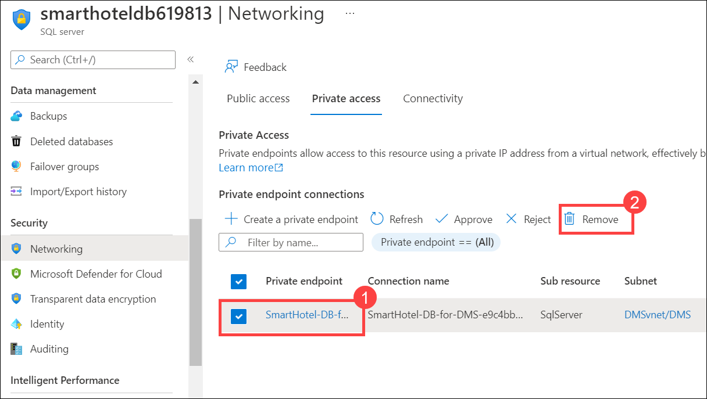

#### Task summary 

In this task you used an off-line data migration activity in the Azure Database Migration Service to migrate the database data from the on-premises SQL Server database to the Azure SQL database.

#### Exercise summary 

In this exercise you migrated the application database from on-premises to Azure SQL Database. The Microsoft Data Migration Assistant was used for migration assessment, and the Azure Database Migration Service was used for schema migration and data migration.
