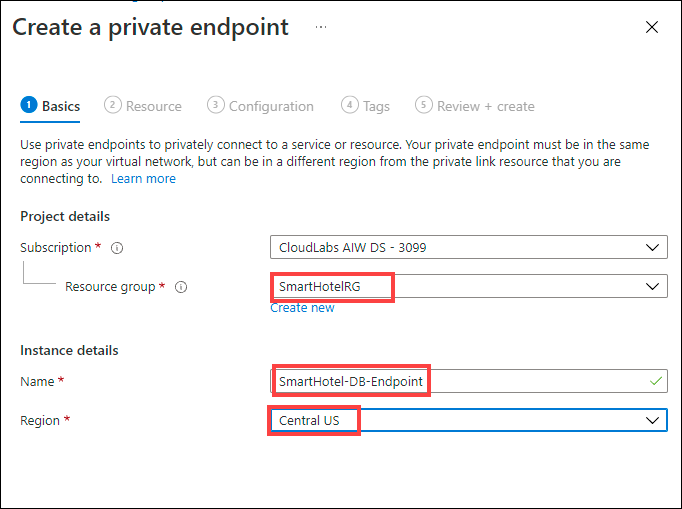
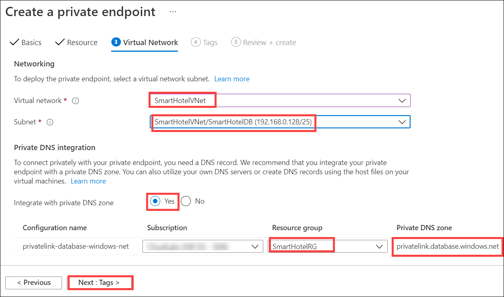
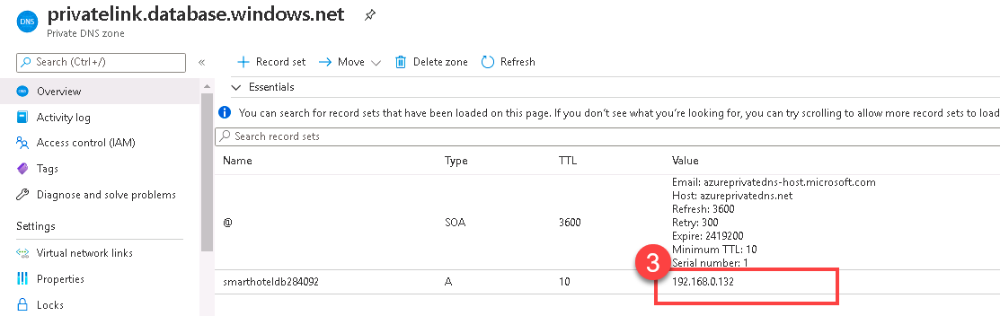
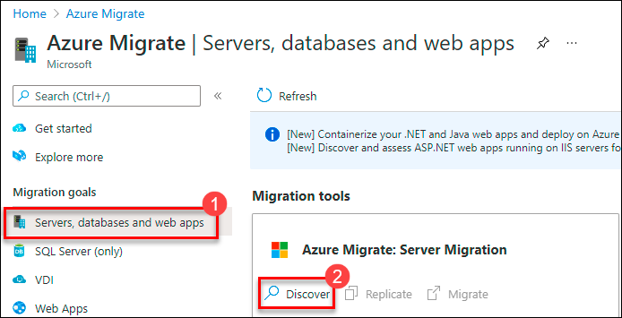
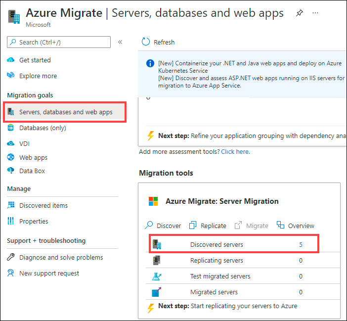
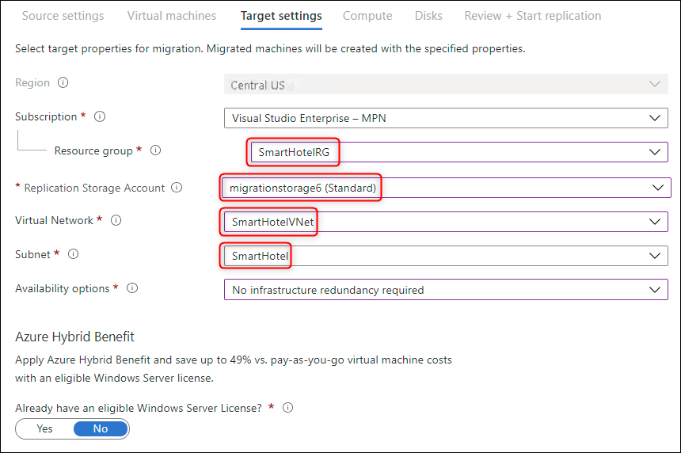
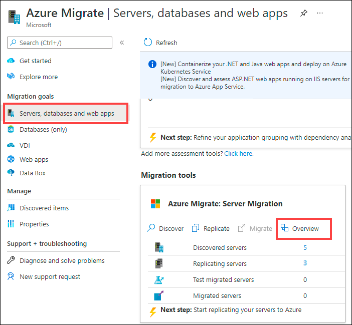
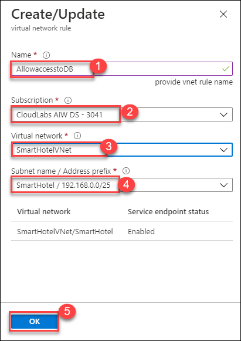

## Exercise 3: Migrate the application and web tiers using Azure Migrate: Server Migration

Duration: 90 minutes

In this exercise you will migrate the web tier and application tiers of the application from on-premises to Azure using Azure Migrate: Server Migration.

Having migrated the virtual machines, you will reconfigure the application tier to use the application database hosted in Azure SQL. This will enable you to verify that the migration application is working end-to-end.

### Task 1: Create a Storage Account

In this task you will create a new Azure Storage Account that will be used by Azure Migrate: Server Migration for storage of your virtual machine data during migration.

> **Note:** This lab focuses on the technical tools required for workload migration. In a real-world scenario, more consideration should go into the long-term plan prior to migrating assets. The landing zone required to host VMs should also include considerations for network traffic, access control, resource organization, and governance. For example, the CAF Migration Blueprint and CAF Foundation Blueprint can be used to deploy a pre-defined landing zone, and demonstrate the potential of an Infrastructure as Code (IaC) approach to infrastructure resource management. For more information, see [Azure Landing Zones](https://docs.microsoft.com/azure/cloud-adoption-framework/ready/landing-zone/) and [Cloud Adoption Framework Azure Migration landing zone Blueprint sample](https://docs.microsoft.com/azure/governance/blueprints/samples/caf-migrate-landing-zone/).

1. In the Azure portal's left navigation, select **+ Create a resource**, then search for and select **Storage account**, followed by **Create**.

    

2. In the **Create storage account** blade, on the **Basics** tab, use the following values:

   - Subscription: **Select your Azure subscription**.
  
   - Resource group: **AzureMigrateRG**
  
   - Storage account name: **migrationstorage<inject key="DeploymentID" enableCopy="false" />**

   - Location: Select <inject key="Region" enableCopy="false" />** from the dropdown..
    
   - Performance: **Standard**
  
   - Redundancy: **Locally-redundant storage (LRS)**

    

3. Select **Review + create**, then select **Create**.

4. Once the storage account is deployed, click on **Go to resource** to open it.

5. Select **Data protection** under **Data management** from the left-hand side menu of storage account.

   

6. Now, uncheck the box next to **Enable soft delete for blobs** and **Enable soft delete for containers** to disable the soft delete on blobs and container as the soft delete enabled storage account is **not supported** for enabling replication on Virtual Machines. Click on **Save**.

   > (You will enable replication on Virtual Machines in Task4 of this Exercise)

   


#### Task summary 

In this task you created a new Azure Storage Account that will be used by Azure Migrate: Server Migration.

### Task 2: Create a Private Endpoint

In this task you will create an endpoint on the provided virtual network that will be used by the SQL Server resource.

> **Note:** Azure provides several options for deploying the right network configuration. After the lab, if you’d like to better understand your networking options, see the [network decision guide](https://docs.microsoft.com/azure/cloud-adoption-framework/decision-guides/software-defined-network/), which builds on the Cloud Adoption Framework’s Azure landing zones. 

You will also configure a private endpoint in this network to allow private, secure access to the SQL Database.

1. Navigate to the **SmartHotelRG** resource group, and then to the **SmartHoteldb<inject key="DeploymentID" enableCopy="false" />** database server. Under **Security**, select **Private endpoint connections**, then select **+ Private endpoint**.

1. On the **Basics** tab, enter the following configuration then select **Next: Resource**:

   - Resource group: **SmartHotelRG**
  
   - Name: **SmartHotel-DB-Endpoint**
  
   - Region: Select <inject key="Region" enableCopy="false" />** from the dropdown.
  
   
   

1. On the **Resource** tab, make sure the following configurations are selected and select **Next: Virtual Network**:

   - Connection method: **Connect to an Azure resource in my directory**.
  
   - Subscription: **your subscription**.
  
   - Resource type: **Microsoft.Sql/servers**
  
   - Resource: **SmartHoteldb<inject key="DeploymentID" enableCopy="false" />**.
  
   - Target sub-resource: **sqlServer**

   
   
1. On the **Virtual Network** tab, enter the following configuration select **Tags** and click on **Review + Create** then **Create**:

   - Virtual network: **SmartHotelVNet**
  
   - Subnet: **SmartHotelDB (192.168.0.128/25)**
  
   - Integrate with private DNS zone: **Yes**
   
   - Resource Group: Select **SmartHotelRG** from the drop down.
 
   - Private DNS zone: (default) **privatelink.database.windows.net**

    

1. **Wait** for the deployment to complete. Navigate to the **SmartHotelRG** resource group, and then to the endpoint **SmartHotel-DB-Endpoint**.
   On the **SmartHotel-DB-Endpoint** private endpoint blade , from the left hand side menu select **DNS configuration** which is under **Settings**.

   
 
   On the **SmartHotel-DB-Endpoint | DNS configuration**, select the **Private DNS Zone** **privatelink.database.windows.net**.

   

   On the **privatelink.database.windows.net** overview blade, note that the **Record set** with name **smarthoteldb<inject key="Suffix" />** and an internal IP address **192.168.0.132** is listed.

   
    
> **Note**: Private DNS is used so that the database domain name, **\<your server\>.database.windows.net** resolves to the internal private endpoint IP address **192.168.0.132** when resolved from the SmartHotelVNet, but resolves to the Internet-facing IP address of the database server when resolved from outside the VNet. This means the same connection string (which contains the domain name) can be used in both cases.


#### Task summary 

In this task you created a new virtual network that will be used by your virtual machines when they are migrated to Azure. You also created a private endpoint in this network, which will be used to access the SQL database.

### Task 3: Register the Hyper-V Host with Azure Migrate: Server Migration

In this task, you will register your Hyper-V host with the Azure Migrate: Server Migration service. This service uses Azure Site Recovery as the underlying migration engine. As part of the registration process, you will deploy the Azure Site Recovery Provider on your Hyper-V host.

1. Return to the **Azure Migrate | Servers, databases and web apps** blade in the Azure Portal, and select **Servers, databases and web apps (1)** under **Migration goals** on the left. Under **Migration Tools**, select **Discover (2)**.

   **Note:** You may need to add the migration tool yourself by following the link below the **Migration Tools** section, selecting **Azure Migrate: Server Migration**, then selecting **Add tool(s)**.
   
    

2. In the **Discover** panel, provide the following details:
   - Under **Are your machines virtualized**, select **Yes, with Hyper-V**.
   - Under **Target region** the region is automatically selected as same the Resource Group's region.
   - Check the **confirmation** checkbox and select **Create resources** to begin the deployment of the Azure Site Recovery resource used by Azure Migrate: Server Migration for Hyper-V migrations.

   

   Once deployment is complete, the 'Discover machines' panel should be updated with additional instructions.
  
3. Click on the **Download** link for the Hyper-V replication provider software installer to download the Azure Site Recovery provider installer.

   

4. Return to the **Discover** page in your browser and select the blue **Download** button and download the registration key file.

   


5. Open the **AzureSiteRecoveryProvider.exe** installer you downloaded a moment ago. On the **Microsoft Update** tab, select **Off** and select **Next**. Accept the default installation location and select **Install**.

   

6. When the installation has completed select **Register**. Browse to the location of the key file you downloaded. When the key is loaded select **Next**.

   

7. Select **Connect directly to Azure Site Recovery without a proxy server** and select **Next**. The registration of the Hyper-V host with Azure Site Recovery will begin.

8. Wait for registration to complete (this may take several minutes). Then select **Finish**.

   

9. Return to the Azure Migrate browser window. **Refresh** your browser, then re-open the **Discover machines** panel by selecting **Discover** under **Azure Migrate: Server Migration** and selecting **Yes, with Hyper-V** for **Are your machines virtualized?**.

10. Select **Finalize registration**, which should now be enabled.

    

11. Azure Migrate will now complete the registration with the Hyper-V host. **Wait** for the registration to complete. This may take several minutes.

    

12. Once the registration is complete, close the **Discover machines** panel using **X** button.

    

13. The **Azure Migrate: Server Migration** panel should now show 5 discovered servers..

    

#### Task summary 

In this task you registered your Hyper-V host with the Azure Migrate Server Migration service.

### Task 4: Enable Replication from Hyper-V to Azure Migrate

In this task, you will configure and enable the replication of your on-premises virtual machines from Hyper-V to the Azure Migrate Server Migration service.

1. Under **Azure Migrate: Server Migration**, select **Replicate**. This opens the **Replicate** wizard.

   

2. In the **Source settings** tab, under **Are your machines virtualized?**, select **Yes, with Hyper-V** from the drop-down. Then select **Next**.

   

3. In the **Virtual machines** tab, under **Import migration settings from an assessment**, select **Yes, apply migration settings from an Azure Migrate assessment**. Select the **SmartHotel VMs** VM group and the **SmartHotelAssessment** migration assessment.

   

4. The **Virtual machines** tab should now show the virtual machines included in the assessment. Select the **UbuntuWAF**, **smarthotelweb1**, and **smarthotelweb2** virtual machines, then select **Next**.

   

5. On the **Target settings** tab, select the below information,
   - Select your subscription and the existing **SmartHotelRG** resource group. 
   - **Replication storage account**: Select the **migrationstorage<inject key="DeploymentID" enableCopy="false" />** storage account.
   - **Virtual Network**: Select **SmartHotelVNet**. 
   - **Subnet**: Select **SmartHotel**. Select **Next**.
 
 
   

 > **Note:** For simplicity, in this lab you will not configure the migrated VMs for high availability, since each application tier is implemented using a single VM.

6. On the **Compute** tab, select the below configuration,
   - Select the **Standard_F2s_v2** VM size for each virtual machine. 
   - Select the **Windows** operating system for the **smarthotelweb1**, **smarthotelweb2** virtual machines.
   - Select the **Linux** operating system for the **UbuntuWAF** virtual machine. 
   - Select **Next**. 


   
    

7. In the **Disks** tab, review the settings but do not make any changes. Select **Next: Tags**, then select **Replicate** to start the server replication.

8. In the **Azure Migrate - Servers, databases and web apps** blade, under **Azure Migrate: Server Migration**, select the **Overview** button.

    
    
9. Confirm that the 3 machines are replicating.

   

10. Select **Replicating Machines** under **Manage** on the left.  Select **Refresh** occasionally and wait until all three machines have a **Protected** status, which shows the initial replication is complete. This will take 5-10 minutes.

    

   > **Note**: Please make sure to run the **validation steps** for this task before moving to next tasks as there are few dependencies. **Not** running the validation after performing this task will result in **validation failure**  as the status of the Virtual Machine will be changed from **Protected** to **Planned  failover** when you migrate the servers in Task6.

#### Task summary 

In this task you enabled replication from the Hyper-V host to Azure Migrate, and configured the replicated VM size in Azure.

### Task 5: Configure static internal IP addresses for each VM

In this task you will modify the settings for each replicated VM to use a static private IP address that matches the on-premises IP addresses for that machine.

1. Still using the **Azure Migrate: Server Migration - Replicating machines** blade, select the **smarthotelweb1** virtual machine. This opens a detailed migration and replication blade for this machine. Take a moment to study this information.

   

2. Select **Compute and Network** under **General** on the left, then select **Edit**.

   

3. Confirm that the VM is configured to use the **F2s_v2** VM size.

4. Under **Network Interfaces**, select **InternalNATSwitch** to open the network interface settings.

   

5. Change the **Private IP address** to **192.168.0.4**.

   

6. Select **OK** to close the network interface settings blade, then **Save** the **smarthotelweb1** settings.

7. Repeat these steps to configure the private IP address for the other VMs.
 
   - For **smarthotelweb2** use private IP address **192.168.0.5**
  
   - For **UbuntuWAF** use private IP address **192.168.0.8**

#### Task summary 

In this task you modified the settings for each replicated VM to use a static private IP address that matches the on-premises IP addresses for that machine

> **Note**: Azure Migrate makes a "best guess" at the VM settings, but you have full control over the settings of migrated items. In this case, setting a static private IP address ensures the virtual machines in Azure retain the same IPs they had on-premises, which avoids having to reconfigure the VMs during migration (for example, by editing web.config files).

### Task 6: Server migration

In this task you will perform a migration of the UbuntuWAF, smarthotelweb1, and smarthotelweb2 machines to Azure.

> **Note**: In a real-world scenario, you would perform a test migration before the final migration. To save time, you will skip the test migration in this lab. The test migration process is very similar to the final migration.

1. Return to the **Azure Migrate: Server Migration** overview blade. Under **Step 3: Migrate**, select **Migrate**.

   

2. On the **Migrate** blade, select **yes** for **Shutdown machines before migration to minimum data loss** and select the 3 virtual machines then select **Migrate** to start the migration process.

   

   > **Note**: You can optionally choose whether the on-premises virtual machines should be automatically shut down before migration to minimize data loss. Either setting will work for this lab.

3. The migration process will start.

   

4. To monitor progress, select **Jobs** under **Manage** on the left and review the status of the three **Planned failover** jobs.

   

5. **Wait** until all three **Planned failover** jobs show a **Status** of **Successful**. You should not need to refresh your browser. This could take up to 15 minutes.

   

6. Navigate to the **SmartHotelRG** resource group and check that the VM, network interface, and disk resources have been created for each of the virtual machines being migrated.

   

#### Task summary 

In this task you used Azure Migrate to create Azure VMs using the settings you have configured, and the data replicated from the Hyper-V machines. This migrated your on-premises VMs to Azure.

### Task 7: Configure the database connection

The application tier machine **smarthotelweb2** is configured to connect to the application database running on the **smarthotelsql** machine.

On the migrated VM **smarthotelweb2**, this configuration needs to be updated to use the Azure SQL Database instead.

> **Note**: You do not need to update any configuration files on **smarthotelweb1** or the **UbuntuWAF** VMs, since the migration has preserved the private IP addresses of all virtual machines they connect with.

1. From the Azure portal menu which is present at the top left, click on **All services**. Select **compute** from the left hand menu and select **Virtual machines**.

2. Click on **smarthotelweb2** VM, from the overview blade, and select **Connect**. Select **Bastion** from the available options and click on **Use Bastion**.

   **Note:** You may have to wait a few minutes and refresh to have the option to enter the credentials. 

3. Connect to the machine with the username **Administrator** and the password <inject key="SmartHotelHost Admin Password"></inject>. When prompted, **Allow** clipboard access.

   

4. In the **smarthotelweb2** remote desktop session, open File Explorer and navigate to the **C:\\inetpub\\SmartHotel.Registration.Wcf** folder. Double-select the **Web.config** file and open with Notepad.

5. Update the **DefaultConnection** setting to connect to your Azure SQL Database.

   You can find the connection string for the Azure SQL Database in the Azure portal. Navigate to the **SmartHotelRG** resource group, and then to the database **smarthoteldb** and  from the overview, select **Show database connection strings**.

   

    Copy the **ADO.NET** connection string, and paste into the web.config file on **smarthotelweb2**, replacing the existing connection string.  **Be careful not to overwrite the 'providerName' parameter which is specified after the connection string.**

    > **Note:** You may need to open the clipboard panel on the left-hand edge of the Bastion window, paste the connection string there, and then paste into the VM.

    Set the password in the connection string to **<inject key="SmartHotelHost Admin Password" />**.

    

6. **Save** the `web.config` file and exit your Bastion remote desktop session.

#### Task summary 

In this task, you updated the **smarthotelweb2** configuration to connect to the Azure SQL Database.

### Task 8: Configure the public IP address and test the SmartHotel application

In this task, you will associate an Application Gateway with Web Application Firewall (WAF) to replace the Ubuntu VM with the Azure managed service.

1. Navigate to the **SmartHotel-WAF** Application Gateway in the **SmartHotelRG** resource group

1. Select **Backend pools** under the Settings section, and select the **WebBackend** pool

    

1. Set the Target type to **Virtual machine** and the Target to the NIC of **smarthotelweb1**; select **Save** to update the backend pool

    

    > **Note:** This backend pool is already associated with the front-end IP address of the Application Gateway via the SmartHotelApp rule. The front-end IP, listener, rule, and backend pool were all created with the Application Gateway. This step now ties the migrated VM to the front end.

1. Navigate to the **SmartHotelRG** resource group, and then to the **SmartHoteldb<inject key="DeploymentID" enableCopy="false" />** database server to update the Firewall settings.
           
1. Under Security, select **Networking** then **Public access** tab. Now, set **Public network access** to **Selected networks** and **Save** your changes.

    
     
1. Now, on the **Public access** tab, click on **Add a virtual network rule** to add a virtual network so that the access to the database will be allowed from specific network.

    
   
1. On the **Create/Update** blade, enter the below information.

    - **Name**: **AllowaccesstoDB**
    - **Subscription**: Select your subscription from the dropdown.
    - **Virtual Network**: Select **SmartHotelVNet**. 
    - **Subnet**: Select **SmartHotel**.
    - Click on **Enable** and then **Ok**.

    
   
1. Navigate back to the **Public access** tab of **Networking** section. Set **Public network access** to **Disabled** and **Save** your changes.

    
   
1. Navigate back to the **SmartHotel-WAF** Application Gateway then **Frontend IP configurations** way in the Settings section, and note the IP address associated with the public IP address **appGwPublicFrontendIp**.

    

1. Open a new browser tab and paste the IP address into the address bar. Verify that the SmartHotel360 application is now available in Azure.

    
 
    > **Note**: 
      1. The Check-in and Check-out might differ for you when compared to the above screenshot.
      2. At this point the base Application Gateway service is providing access to the backend application. This validates that the application is working and can be further protected by the WAF in following steps.

1. Select **Web application firewall** under the Settings section and change the Tier to **WAF V2**.  Also, change the Firewall status to **Enabled**, the Firewall mode to **Prevention**, and set the Max request body size (KB) to **32**.  Select **Save** to commit the changes.

    

1. Once the application gateway changes have been saved, go back to your web browser with the public IP address of the application gateway you used earlier and refresh the browser to have a page processed by the WAF.


#### Task summary 

In this task, you assigned a public IP address to the UbuntuWAF VM and verified that the SmartHotel application is now working in Azure.

### Task 9: Post-migration steps

There are a number of post-migration steps that should be completed before the migrated services are ready for production use. These include:

- Installing the Azure VM Agent

- Cleaning up migration resources

- Enabling backup and disaster recovery

- Encrypting VM disks

- Ensuring the network is properly secured

- Ensuring proper subscription governance is in place, such as role-based access control and Azure Policy

- Reviewing recommendations from Azure Advisor and Security Center

In this task you will install the Azure Virtual Machine Agent (VM Agent) on your migrated Azure VMs and clean up any migration resources. The remaining steps are common for any Azure application, not just migrations, and are therefore out of scope for this hands-on lab.

> **Note**: The Microsoft Azure Virtual Machine Agent (VM Agent) is a secure, lightweight process that manages virtual machine (VM) interaction with the Azure Fabric Controller. The VM Agent has a primary role in enabling and executing Azure virtual machine extensions. VM Extensions enable post-deployment configuration of VM, such as installing and configuring software. VM extensions also enable recovery features such as resetting the administrative password of a VM. Without the Azure VM Agent, VM extensions cannot be used.

> In this lab, you will install the VM agent on the Azure VMs after migration. Alternatively, you could instead install the agent on the VMs in Hyper-V before migration.

1. In the Azure portal, locate the **smarthotelweb1** VM and select **Connect**. Select **Bastion** from the available options and click on **Use Bastion**.

Log in to the **Administrator** account using password **<inject key="SmartHotelHost Admin Password" />** (use the 'eyeball' to check the password was entered correctly with your local keyboard mapping).

2. Open a web browser and download the VM Agent from:

    ```s
    https://go.microsoft.com/fwlink/?LinkID=394789
    ```

    **Note**: You may need to open the clipboard panel on the left-hand edge of the Bastion window, paste the URL, and then paste into the VM.

3. After the installer has downloaded, run it. Select **Next**, Select **I accept the terms in the License Agreement**, and then **Next** again. Select **Finish**.

   

4. Close the smarthotelweb1 window. Repeat the Azure VM agent installation process on **smarthotelweb2**.

You will now install the Linux version of the Azure VM Agent on the Ubuntu VM. All Linux distributions supports by Azure have integrated the Azure VM Agent into their software repositories, making installation easy in most cases.

5. In the Azure portal, locate the **UbuntuWAF** VM and **Connect** to the VM using Azure Bastion, with the user name **demouser** and password **<inject key="SmartHotelHost Admin Password" />**. Since this is a Linux VM, Bastion will create an SSH session. You may need to enter the credentials again. 

6. In the SSH session, enter the following commands:

   ```s
   sudo apt-get update
   ```
   ```s
   sudo apt-get install walinuxagent
   ```

   When prompted, enter the password **<inject key="SmartHotelHost Admin Password" />**. At the *Do you want to continue?* prompt, type **Y** and press **Enter**.

   **Note**: You may need to open the clipboard panel on the left-hand edge of the Bastion window, paste the command, and then paste into the VM.

   

7. Wait for the installer to finish, then close the terminal window and the Ubuntu VM window.

To demonstrate that the VM Agent is installed, we will now execute the 'Run command' feature from the Azure portal. For more information on the VM Agent, see [Windows VM Agent](https://docs.microsoft.com/azure/virtual-machines/extensions/agent-windows) and [Linux VM Agent](https://docs.microsoft.com/azure/virtual-machines/extensions/agent-linux).

8. Navigate to the **smarthotelweb1** blade. Under **Operations**, select **Run command**, followed by **IPConfig**, followed by **Run**. After a few seconds, you should see the output of the IPConfig command.

   


#### Task summary 

In this task you installed the Azure Virtual Machine Agent (VM Agent) on your migrated VMs. You also cleaned up the temporary resources created during the migration process.

### Exercise summary 

In this exercise you migrated the web tier and application tiers of the application from on-premises to Azure using Azure Migrate: Server Migration. Having migrated the virtual machines, you reconfigured the application tier to use the migrated application database hosted in Azure SQL Database, and verified that the migrated application is working end-to-end. You also installed the VM Agent on the migrated virtual machines, and cleaned up migration resources.
