# Exercise 3: Migrate the application and web tiers using Azure Migrate: Migration and modernization

Duration: 90 minutes

In this exercise you will migrate the web tier and application tiers of the application from on-premises to Azure using Azure Migrate: Migration and modernization.

Having migrated the virtual machines, you will reconfigure the application tier to use the application database hosted in Azure SQL. This will enable you to verify that the migration application is working end-to-end.

## Task 1: Create a Storage Account

In this task you will create a new Azure Storage Account that will be used by Azure Migrate: Migration and modernization for storage of your virtual machine data during migration.

> **Note:** This lab focuses on the technical tools required for workload migration. In a real-world scenario, more consideration should go into the long-term plan prior to migrating assets. The landing zone required to host VMs should also include considerations for network traffic, access control, resource organization, and governance. For example, the CAF Migration Blueprint and CAF Foundation Blueprint can be used to deploy a pre-defined landing zone, and demonstrate the potential of an Infrastructure as Code (IaC) approach to infrastructure resource management. For more information, see [Azure Landing Zones](<https://docs.microsoft.com/azure/cloud-adoption-framework/ready/landing-zone/>) and [Cloud Adoption Framework Azure Migration landing zone Blueprint sample](<https://docs.microsoft.com/azure/governance/blueprints/samples/caf-migrate-landing-zone/>).

1. In the Azure portal's left navigation, select **+ Create a resource**, then search for and select **Storage account**, followed by **Create**.

    

2. In the **Create storage account** blade, on the **Basics** tab, use the following values:

    - Subscription: **Select your Azure subscription**.
  
    - Resource group: **AzureMigrateRG**
  
    - Storage account name: **migrationstorage<inject key="DeploymentID" />**
  
    - Location: **IMPORTANT: Select the same location as your Resource Group** (can be found in the Azure portal).
  
    - Replication: **Locally-redundant storage (LRS)**

    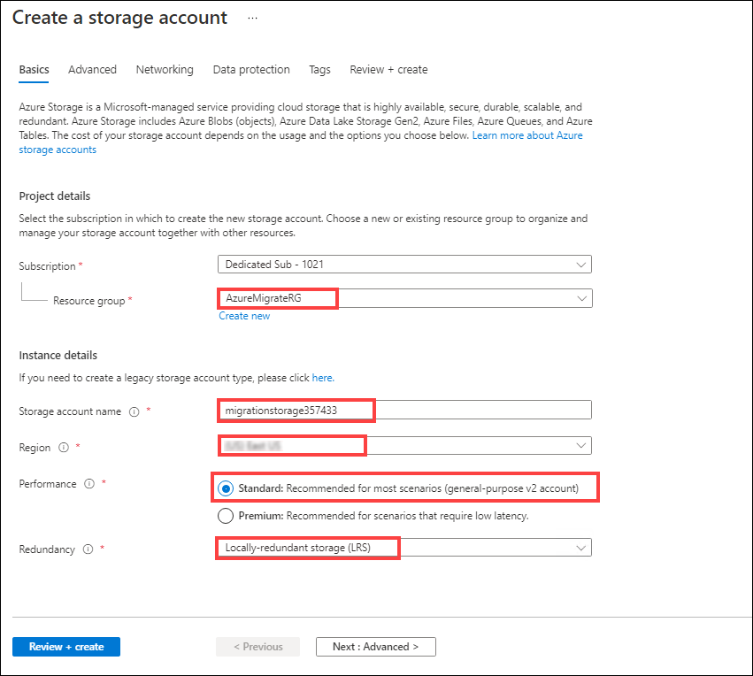

3. Select **Review + create**, then select **Create**.

### Task 1 summary

In this task you created a new Azure Storage Account that will be used by Azure Migrate: Migration and modernization.

## Task 2: Create a Virtual Network

In this task you will create a new virtual network that will be used by your migrated virtual machines when they are migrated to Azure. (Azure Migrate will only create the VMs, their network interfaces, and their disks; all other resources must be staged in advance.)

> **Note:** Azure provides several options for deploying the right network configuration. After the lab, if you’d like to better understand your networking options, see the [Network decision guide](<https://docs.microsoft.com/azure/cloud-adoption-framework/decision-guides/software-defined-network/>), which builds on the Cloud Adoption Framework’s Azure landing zones.

You will also configure a private endpoint in this network to allow private, secure access to the SQL Database.

1. In the Azure portal's left navigation, select **+ Create a resource**, then search for and select **Virtual network**, followed by **Create**.

    

1. In the **Create virtual network** blade, enter the following values:

    - Subscription: **Select your Azure subscription**.
  
    - Resource group: (select existing) **SmartHotelRG**
  
    - Name: **SmartHotelVNet**
  
    - Region: **IMPORTANT: Select the same location as your Resource Group**.

    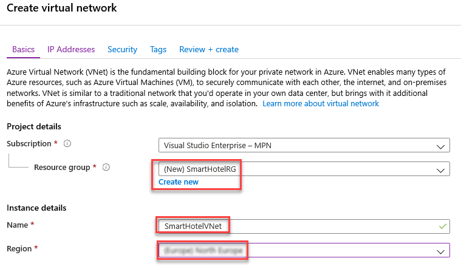

1. Select **Next: IP Addresses >**, and enter the following configuration.

    - IPv4 address space: **192.168.0.0/16**

    - First subnet: Select **Add subnet** and enter the following then select **Add**

        - Subnet name: **SmartHotel**

        - Address range: **192.168.0.0/24**

        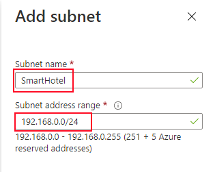

    - Second subnet: Select **Add subnet** and enter the following then select **Add**

        - Subnet name: **SmartHotelWAF**

        - Address range: **192.168.1.0/24**

        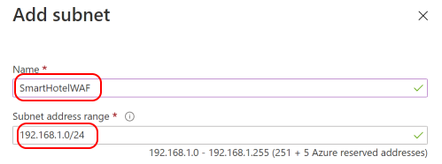

    Finally, it should look as below.

   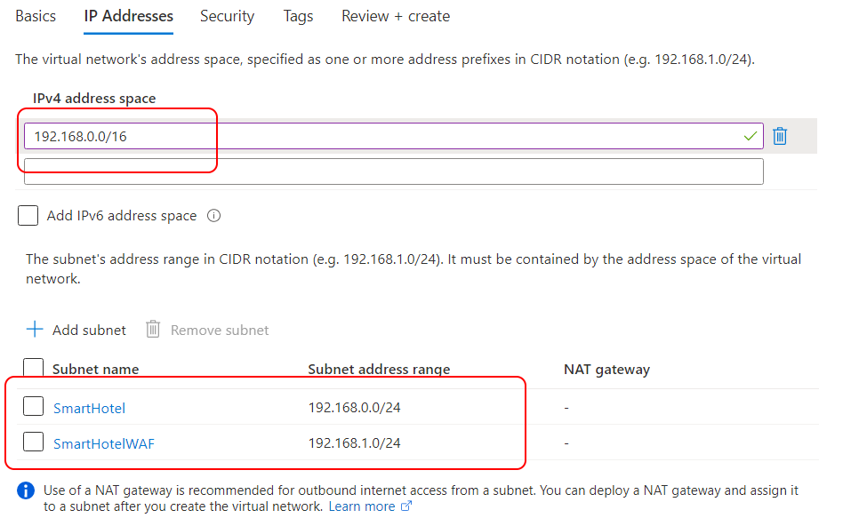

    Then select **Review + create**, then **Create**. Wait till the Virtual Network (VNET) is created.

1. Once the network is created, we shall create an Azure Application firewall that will be used to replace the function currently fulfilled by the SmarthotelWAF linux server. Access the Portal menu using top left corner button and select + Create a resource. Search for **Application Gateway** and select **Create**.

   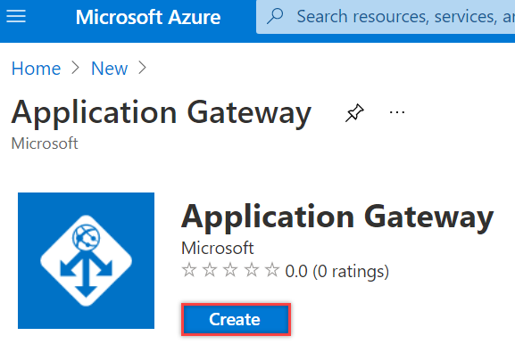

1. In the **Create Application Gateway** blade, enter the following values:

    - Subscription: **Select your Azure subscription**.

    - Resource group: (select existing) **SmartHotelRG**

    - Name: **SmarthotelWAF**

    - Region: **IMPORTANT: Select the same location as your Azure SQL Database**.

    - Tier: **WAF V2**

    - Enable autoscaling: **No**

    - Instance count: **1**

    - Firewall status: **Enabled**

    - Firewall mode: **Detection**

    - Availability Zone: **None**

    - HTTP2: **Disabled**

    - Virtual Network: **SmartHotelVNET**

    - Subnet: **SmartHotelWAF**

    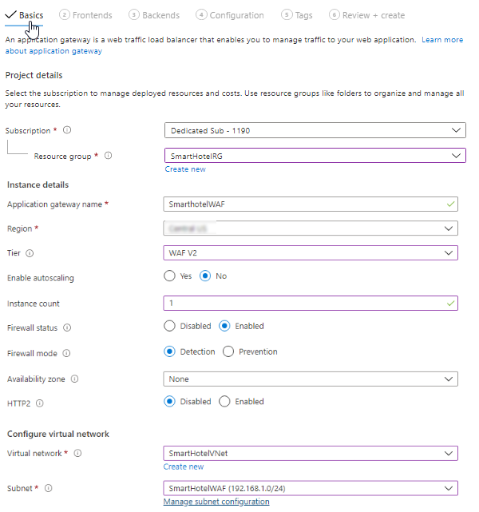

 
1. Select **Next: Frontends >** and enter the below configuration details:

    - Frontend IP address type: **Public**

    - Public IP address: (Add new) **SmartHotel-PublicIP**

        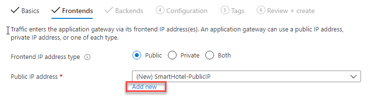

1. Select **Next: Backend >** and click on the link **Add a backend pool**. On the New backend pool panel, enter the below configuration details:
    >Note: We will be adding BackendPool targets later once the web server is migrated.

    - Name: **SmartHotelBackendPool**
    - Add backend pool without targets: **Yes**

     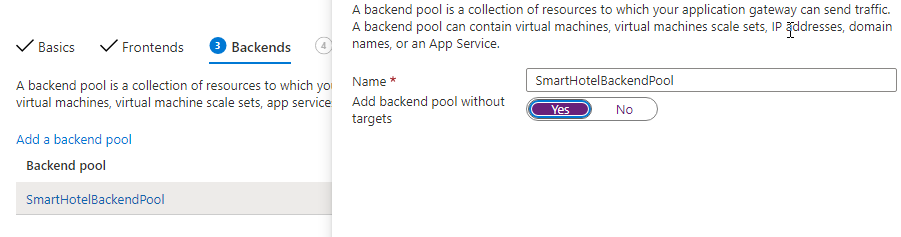

1. Select **Next: Configuration >** and Click on Add a Routing Rule.

     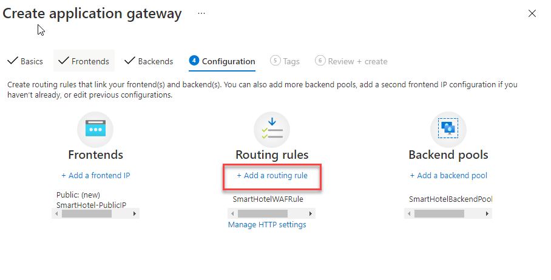
 
     On the **Add a routing rule** panel, enter the following configuration: 

    - Rule Name: **SmartHotelWAFRule**

    **Listener** Section

    - Listener name: **SmartHotelWAFListener**
    - FrontEnd IP: (Select) **Public**
    - Protocol: **HTTP**
    - Port: **80**
    - Listener Type: **Basic**
    - Error Page url: **No**

    **Backend targets** Section

    - Target type: **Backend Pool**
    - Backend Target: (Select) **SmartHotelBackendPool**
    - HTTPSettings: (Add New) **SmartHotelWAFHTTPSettings**
        - Backend Protocol: **Basic**
        - Backend Port: **80**

    Click **Add** to return to the Configuration tab

     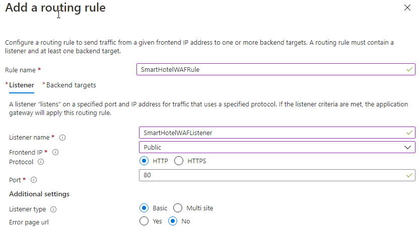

     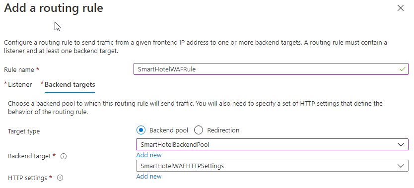

     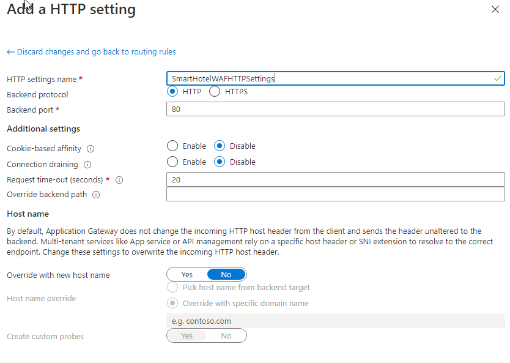
 

1. Finally click **Next: > Tags**, **Review + create**, then **Create**. Wait till the application Gateway is created is created.

### Task 2 summary

In this task you created a new virtual network that will be used by your virtual machines when they are migrated to Azure. You also provisioned a Azure Gateway WAF firewall

## Task 3: Register the Hyper-V Host with Azure Migrate: Migration and modernization

In this task, you will register your Hyper-V host with the Azure Migrate: Migration and modernization service. This service uses Azure Site Recovery as the underlying migration engine. As part of the registration process, you will deploy the Azure Site Recovery Provider on your Hyper-V host.

1. Return to the **Azure Migrate** blade in the Azure Portal, and select **Servers** under **Migration goals** on the left. Under **Migration Tools**, select **Discover**.

    **Note:** You may need to add the migration tool yourself by following the link below the **Migration Tools** section, selecting **Azure Migrate: Migration and modernization**, then selecting **Add tool(s)**. 

    

2. In the **Discover machines** panel,
   - under **Are your machines virtualized**, select **Yes, with Hyper-V**.
   - Under **Target region** the region should be selected as same as your Resource Group's region.

    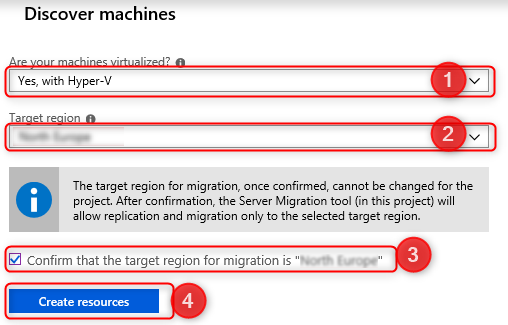

    Once deployment is complete, the 'Discover machines' panel should be updated with additional instructions.
  
3. Copy the **Download** link for the Hyper-V replication provider software installer to your clipboard.

    

4. Launch **Microsoft Edge** from the desktop shortcut, and paste the link into a new browser tab to download the Azure Site Recovery provider installer..

5. Return to the **Discover machines** page in your browser and select the blue **Download** button and download the registration key file.

    

6. Open the **AzureSiteRecoveryProvider.exe** installer you downloaded a moment ago. On the **Microsoft Update** tab, select **Off** and select **Next**. Accept the default installation location and select **Install**.

    

7. When the installation has completed select **Register**. Browse to the location of the key file you downloaded. When the key is loaded select **Next**.

    

8.  Select **Connect directly to Azure Site Recovery without a proxy server** and select **Next**. The registration of the Hyper-V host with Azure Site Recovery will begin.

9. Wait for registration to complete (this may take several minutes). Then select **Finish**.

    

10. Return to the Azure Migrate browser window. **Refresh** your browser, then re-open the **Discover machines** panel by selecting **Discover** under **Azure Migrate: Migration and modernization** and selecting **Yes, with Hyper-V** for **Are your machines virtualized?**.

11. Select **Finalize registration**, which should now be enabled.

    

12. Azure Migrate will now complete the registration with the Hyper-V host. **Wait** for the registration to complete. This may take several minutes.

    

13. Once the registration is complete, close the **Discover machines** panel using **X** button.

    

14. The **Azure Migrate: Migration and modernization** panel should now show 5 discovered servers..

    

### Task 3 summary

In this task you registered your Hyper-V host with the Azure Migrate Migration service.

## Task 4: Enable Replication from Hyper-V to Azure Migrate

In this task, you will configure and enable the replication of your on-premises virtual machines from Hyper-V to the Azure Migrate Migration service.

1. Under **Azure Migrate: Migration and modernization**, select **Replicate**. This opens the **Replicate** wizard.

    

2. In the **Source settings** tab, under **Are your machines virtualized?**, select **Yes, with Hyper-V** from the drop-down. Then select **Next**.

    

3. In the **Virtual machines** tab, under **Import migration settings from an assessment**, select **Yes, apply migration settings from an Azure Migrate assessment**. Select the **SmartHotel VMs** VM group and the **SmartHotelAssessment** migration assessment.

    

4. The **Virtual machines** tab should now show the virtual machines included in the assessment. Use  the filter value of' smarthotelweb' for listing and select the **smarthotelweb1** and **smarthotelweb2** virtual machines, then select **Next**.

    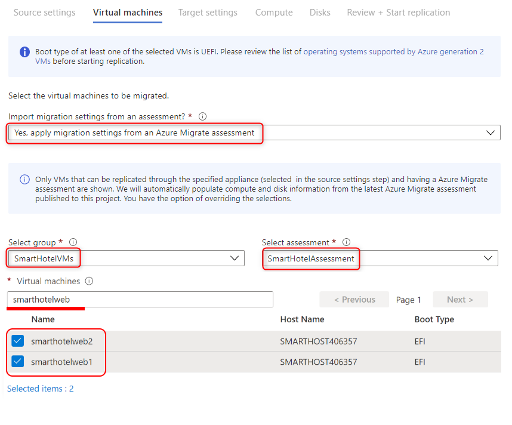

5. In the **Target settings** tab, select your subscription and the existing **SmartHotelRG** resource group. Under **Replication storage account** select the **migrationstorage<inject key="DeploymentID" />** storage account and under **Virtual Network** select **SmartHotelVNet**. Under **Subnet** select **SmartHotel**. For **Azure Hybrid Benefit** click **Yes**. Select **Next**.

    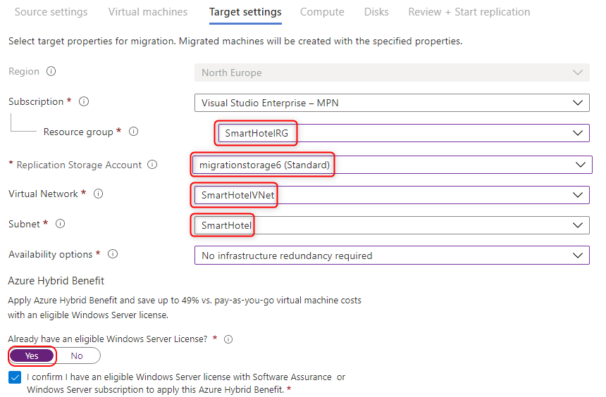

    > **Note:** For simplicity, in this lab you will not configure the migrated VMs for high availability, since each application tier is implemented using a single VM.

6. In the **Compute** tab, select the **Standard_F2s_v2** VM size for each virtual machine. Select the **Windows** operating system for the **smarthotelweb1** and **smarthotelweb2** virtual machines. Select **Next**.

    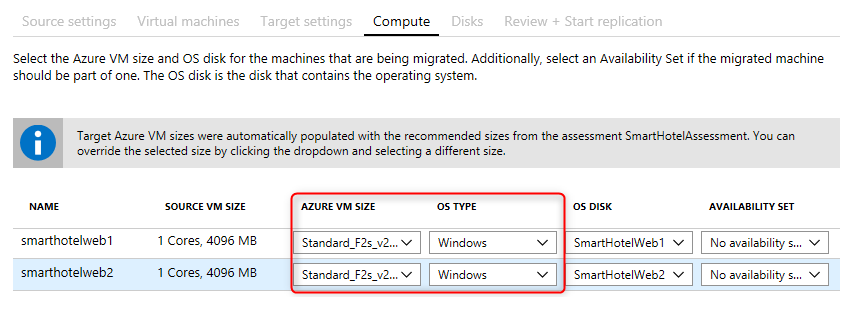

7. In the **Disks** tab, review the settings but do not make any changes. Select **Next**, then select **Replicate** to start the server replication.

8. In the **Azure Migrate - Servers** blade, under **Azure Migrate: Migration and modernization**, select the **Overview** button.

    

9. Confirm that the 2 machines are replicating.

    

10. Select **Replicating Machines** under **Manage** on the left.  Select **Refresh** occasionally and wait until both machines have a **Protected** status, which shows the initial replication is complete. This will take several minutes.

    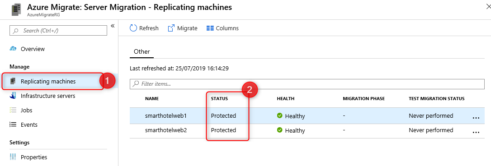

### Task 4 summary

In this task you enabled replication from the Hyper-V host to Azure Migrate, and configured the replicated VM size in Azure.

## Task 5: Configure static internal IP addresses for each VM

In this task you will modify the settings for each replicated VM to use a static private IP address that matches the on-premises IP addresses for that machine.

1. Still using the **Azure Migrate: Migration and modernization - Replicating machines** blade, select the **smarthotelweb1** virtual machine. This opens a detailed migration and replication blade for this machine. Take a moment to study this information.

    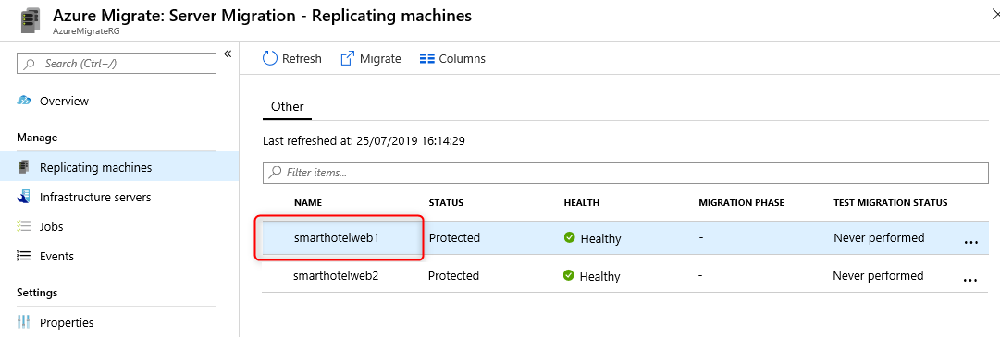

2. Select **Compute and Network** under **General** on the left, then select **Edit**.

   

3. Confirm that the VM is configured to use the **F2s_v2** VM size and that **Use managed disks** is set to **Yes**.

4. Under **Network Interfaces**, select **InternalNATSwitch** to open the network interface settings.

    

5. Change the **Private IP address** to **192.168.0.4**.

    

6. Select **OK** to close the network interface settings blade, then **Save** the **smarthotelweb1** settings.

7. Repeat these steps to configure the private IP address for the other VMs.
 
    - For **smarthotelweb2** use private IP address **192.168.0.5**
  
### Task 5 summary

In this task you modified the settings for each replicated VM to use a static private IP address that matches the on-premises IP addresses for that machine

> **Note**: Azure Migrate makes a "best guess" at the VM settings, but you have full control over the settings of migrated items. In this case, setting a static private IP address ensures the virtual machines in Azure retain the same IPs they had on-premises, which avoids having to reconfigure the VMs during migration (for example, by editing web.config files).

## Task 6: Migration and modernization

In this task you will perform a migration of the UbuntuWAF, smarthotelweb1, and smarthotelweb2 machines to Azure.

> **Note**: In a real-world scenario, you would perform a test migration before the final migration. To save time, you will skip the test migration in this lab. The test migration process is very similar to the final migration.

1. Return to the **Azure Migrate: Migration and modernization** overview blade. Under **Step 3: Migrate**, select **Migrate**.

    

2. On the **Migrate** blade, select **yes** for **Shutdown machines before migration to minimum data loss** and select the 2 virtual machines then select **Migrate** to start the migration process.

    

    > **Note**: You can optionally choose whether the on-premises virtual machines should be automatically shut down before migration to minimize data loss. Either setting will work for this lab.

3. The migration process will start.

    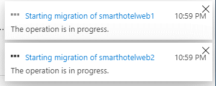

4. To monitor progress, select **Jobs** under **Manage** on the left and review the status of the three **Planned failover** jobs.

    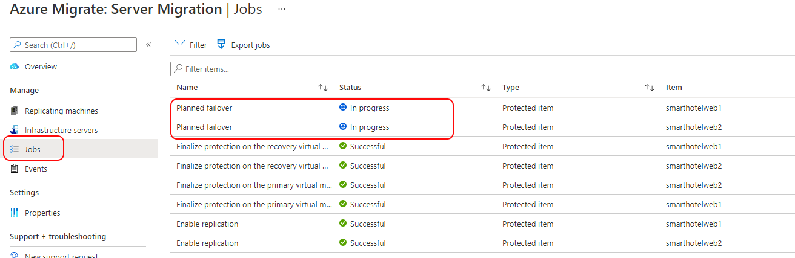

5. **Wait** until all three **Planned failover** jobs show a **Status** of **Successful**. You no need to refresh your browser. This could take up to 15 minutes.

    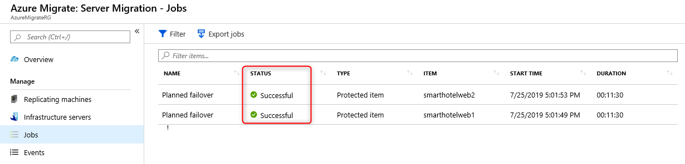

6. Navigate to the **SmartHotelRG** resource group and check that the VM, network interface, and disk resources have been created for each of the virtual machines being migrated.

   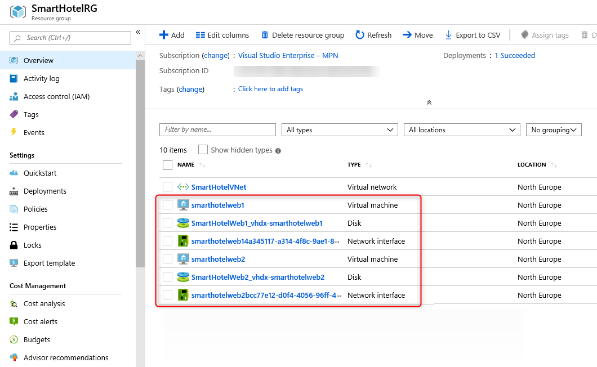

### Task 6 summary

In this task you used Azure Migrate to create Azure VMs using the settings you have configured, and the data replicated from the Hyper-V machines. This migrated your on-premises VMs to Azure.

## Task 7: Configure the Application gateway and test the SmartHotel application

In this task, we will configure the WAF to point to frontend webserver.

1. From the Azure portal search box which is present at the top , Search for and navigate to **Application gateways**.

1. Click on **SmartHotelWAF** Application gateway created during Task 2 above, select **Backend Pools** under **Settings** on the left, then click on  **SmartHotelBackendPool**. 

    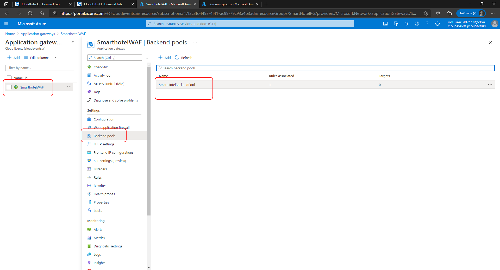

1. In the **Edit Backend Pool** Panel, Select **Virtual Machine** as the target type under **Backend Targets** and select **SmarthotelWAF1**. Then Click **Save**

    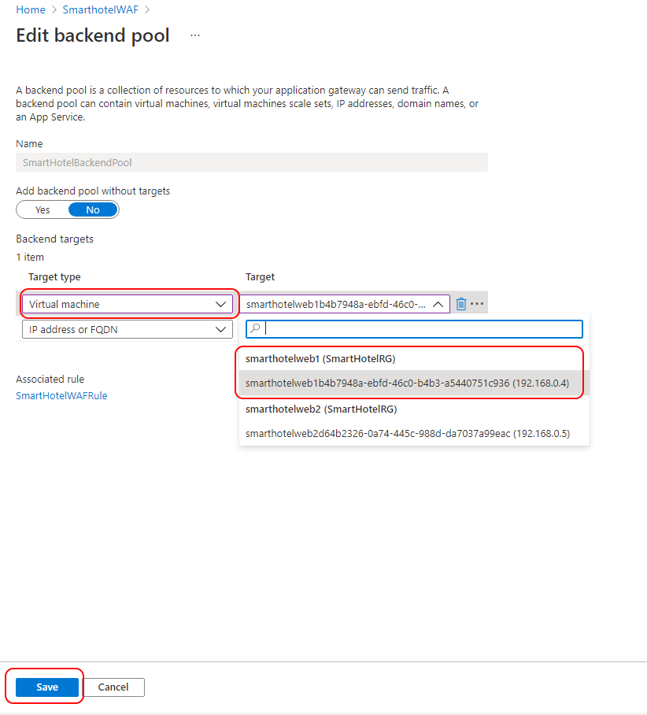

1. Navigate to the **Overview** button within the blade and copy the public IP address **SmartHotel-PublicIP**
     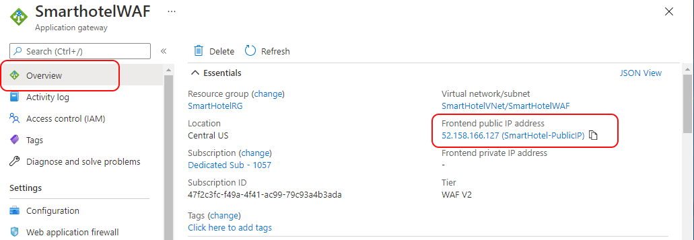

1. Open a new browser tab and paste the IP address into the address bar. Verify that the SmartHotel360 application is now available in Azure

    

### Task 7 summary

In this task, you assigned a public IP address to the Application gateway and verified that the SmartHotel application is now working in Azure.

### Exercise summary

In this exercise you migrated the web tier and application tiers of the application from on-premises to Azure using Azure Migrate: Migration and modernization. Having migrated the virtual machines, you configured the application gateway and verified that the migrated application is working end-to-end.
